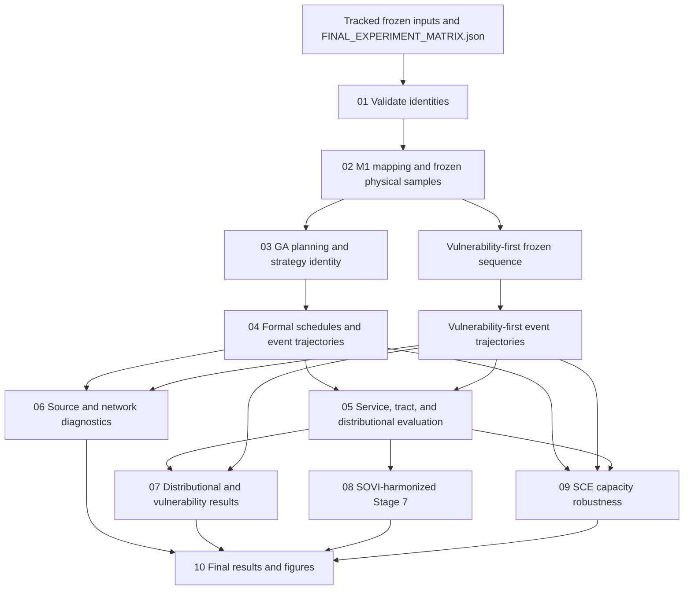

# Final revision workflow crosswalk — audit only

Audit date: 2026-09-28
Repository: `LA_grid_reviewer_revision`
Branch / HEAD: `revision/reviewer-driven-core-rebuild-v2` / `2d54e737ebf3b010507b6186dcbf00a37ef0602c`
Remote branch ref currently resolves to the same HEAD. The protected July archive commit `182686868cffe962739804f6bc0ccecaed73d601` was not modified.

This document records the actual current dependencies before adding canonical wrappers. It does not run or regenerate scientific work. The revision checkout has no existing `FINAL_REVISION_RUN_SEQUENCE` entrypoint. At the time of audit, tracked files were unchanged; the checkout also contains numerous untracked local result archives and external evidence directories.

## Audit conclusion

The repository contains a reproducible formal base experiment, but not yet a single reproducible *final-paper* run path. The original frozen matrix, expanded formal runner, vulnerability-first amendment, SOVI-harmonized Stage 7, source/network diagnostics, capacity closure, and revised result suite each have their own code and identity records. The top-level `README.md` still calls the five July expanded scripts the “Official Workflow.” The formal `--revised-final` CLI is phase-based, but it does not integrate later accepted additions and its phase calls can create missing outputs; it is therefore not a safe `--resume` command by itself.

The existing artifacts are sufficient to build a read-only resume validator on this workstation. A fresh Git clone cannot resume the full final workflow because the large trajectory and selected intermediate archives are local-only and are not in Git LFS. A from-scratch reproduction is technically possible from the tracked scientific inputs and pinned source history, but the current one-command path is not yet assembled. In particular, the vulnerability-first trajectory producer enforces its historical executable commit and must be invoked from that pinned code state if regenerated.

## Actual dependency graph



The full base run has 84,000 archived trajectory records, including 10,000 records under the historical `direct-community` label. The exact identity audit compares all 10,000 `direct-community`/`impact-first` archive pairs and finds their saved state arrays identical. The amendment adds 10,000 vulnerability-first records. The paper-facing distinct strategy set is therefore eight scheduled policies plus Unconstrained; the 10,000 direct-community records remain provenance and are not a separate reported policy. Deduplicating that exact duplicate yields 84,000 distinct final strategy/resource trajectories across the base and vulnerability amendment.

## Stage-by-stage crosswalk

| Canonical stage | Actual implementation and current authority | Inputs → outputs / dependency | Current reproduction status |
|---|---|---|---|
| **01 Validate inputs** | `C257H_Project_Main_expanded.py --validate-final-matrix --matrix FINAL_EXPERIMENT_MATRIX.json --output Formal_Experiment_20260923`; `r1_final_matrix.load_frozen_matrix`, `configure_formal`, `validate_final_inputs`. | Frozen JSON plus 14 hashed mapping, graph, source, PGA/fragility, hospital, population/SOVI, crew and directed-travel inputs → `FINAL_EXECUTION_VALIDATION.json`. | Read-only validation is reproducible from Git. All 14 current input hashes match the frozen validation record and those inputs are tracked. The validation record’s `actual_executable_commit_sha` remains the literal placeholder `RECORDED_AFTER_WIRING_COMMIT`; phase identity files carry actual executable SHAs. |
| **02 Mapping and physical samples** | Formal sampling path in `C257H_Project_Main.py`: `run_formal_samples` → `run_stage_0` / `run_stage_1_revision`; expanded config selects `JULY_UTILITY_CONSTRAINED_92` / `M1_UTILITY_003`. M0 is used only in the declared comparisons. | 92 ordered stations, frozen PGA/fragility, production M1 weights and SeedSequence rules → 4,000 evaluation plus 64 independent 2pc50 planning samples, `PHYSICAL_INPUTS_FROZEN.json`, and sample manifest/hashes. | Samples and hashes are already committed. On resume, verify hashes and zero split overlap; do not call the generator. From-scratch code and the necessary inputs are present. |
| **03 GA planning / strategy identity** | Formal entry’s `run_formal_ga_planning` → `run_stage_5_revision`, using `r1_ga_revision.py` and the direct community objective/evaluator. Final artifacts are `Stage 5 Output_expanded/GA_*`, `GA_FIVE_SEED_CONVERGENCE.csv`, and `FINAL_DIRECT_COMMUNITY_SEQUENCE.json`. | The 64 planning-only 2pc50 samples, seven deterministic rule sequences, fixed GA configuration and M1 direct objective → five-seed convergence and frozen candidate/provenance. | Planning artifacts and code are tracked. The recorded result is that no seed beat the deterministic incumbent; the retained sequence is Impact-first. Validate those files only in resume mode; do not rerun GA. |
| **04 Schedule and trajectories** | Base formal path: `run_formal_schedule_prepass` and `run_formal_trajectory_archives` in `C257H_Project_Main.py`, using `r1_formal_schedule.py`, `r1_realization_scheduling.py`, and `r1_formal_archive.py`. Vulnerability path: `r1_equity_amendment_execute.py`, which reuses frozen samples and its fixed sequence. | Frozen DS/duration, directed travel, crew roster, fixed sequences and completion event clock → 80 schedule-prepass shards, common 480 h horizon, 84,000 base event archives and 10,000 vulnerability-first event archives. | **Local archive required for resume.** `Formal_Trajectories/` contains 84,000 `.npz` + 84,000 `.json` + 84,000 task-event CSV files (about 1.59 GB); `Equity_Amendment/T/` contains 10,000 of each (about 195 MB). Neither archive is tracked or in LFS. Schedule prepass shards are tracked. The existing producer can create a missing trajectory during its normal run, so a future `--resume` wrapper must preflight the complete archives and fail before invoking it. `r1_equity_amendment_execute.py` additionally requires current `HEAD` to equal its recorded historical execution SHA `4dd2a7babb51849852bb169a59df1ca4726cc16f`; that commit exists in history. |
| **05 Service and tract evaluation** | Formal entry’s `run_formal_offline_evaluation` → `r1_formal_offline.evaluate_all_frozen_archives`; summaries through `run_formal_results` → `r1_formal_results.build_formal_results`. Amendment post-processing is `r1_equity_amendment_results.py`. | Saved event states plus M1/M0/cutoff and gate definitions, frozen Q1–Q4, population/hospital metadata and OFAT cases → formal offline shards, paired tract/system summaries and amendment results. | Compact formal and equity summaries are tracked/LFS-backed. `Formal_Offline_Evaluation/` is about 2.05 GB with 84 result shards and only three tracked files; amendment offline is about 222 MB and local-only. Resume can verify committed result indexes and available shard identities without rerunning evaluators. A fresh clone cannot resume from these outputs. |
| **06 Source and network diagnostics** | Existing code includes `r1_formal_mechanism_results.py`, `r1_formal_dynamic_topology.py`, `route_requirement_sensitivity.py`, `substation_connectivity_reliability.py`, and `source_terminal_operational_reliability.py`. Relevant authorities are the formal source-loss/connectivity tables, route-requirement outputs and source-terminal reliability files, not the old pilot audits. | Frozen baseline and amendment event states, graph, source set, M1 and fragility inputs → loss decomposition, dynamic route/connectivity summaries and 2pc50 operational reliability outputs. | Numerical summaries/reports and many result tables are tracked, often through LFS. Dynamic state caches are local-only: `Formal_Dynamic_Topology/` is about 185 MB (about 8,000 files), and connectivity state/event interval caches include additional local-only NPZ/Parquet data. Static reliability can be rerun from tracked inputs; dynamic analyses require the local frozen event archive or their committed result tables. Resume should validate and reuse, not recalculate. |
| **07 Distributional and vulnerability** | `r1_equity_amendment_results.py` compiles the frozen vulnerability-first trajectories/results; paired Q1–Q4 and continuous tract effects use the frozen existing assignment and saved outcomes. | Frozen Q1–Q4, FEMA NRI v1.19 `SOVI_SCORE`, population, tract burdens and vulnerability-first results → absolute quartile burdens, signed/absolute Q4–Q1 gaps, Gini and continuous tract effects/pairwise results. | The amendment JSON/sequence/results indexes and accepted summaries are tracked. The `*_CLASSIFICATION_POPULATION.csv` files using the superseded ±1 h classes are historical provenance only and must not be active outputs. No vulnerability trajectory or Q4 assignment is to be regenerated in resume mode. |
| **08 Final Stage 7 typology** | Final authority is `Formal_Experiment_20260923/Stage 7 Output_SOVI_Harmonized/`, computed by `run_stage7_sovi_harmonization.py` using the Stage 7-only path and checked by `r1_stage7_harmonized.verify_harmonized_stage7`. The formal CLI’s Stage 7 phase returns that verifier read-only. | Frozen tract service/T80, FEMA NRI v1.19 `SOVI_SCORE`, ACS housing and built-environment features → 2,315 full-domain statuses/SOVI/service rows, 2,291 eligible residential clusters, 24 explicit noneligible tracts, PCA/K-means/profiles/hotspots. | The 38 harmonized files are tracked/LFS-backed. The old `Formal_Experiment_20260923/Stage 7 Output_expanded/` is not final authority. The sibling viewing suite has Stage 7 presentation copies; its source remains `Stage 7 Output_SOVI_Harmonized`. `verify_harmonized_stage7` checks coverage and table identities, while no dedicated committed manifest currently records all 38 output hashes. |
| **09 Capacity robustness** | `run_sce_capacity_supported_sensitivity.py` delegates to `sce_capacity_closure.run()` in `sce_capacity_closure.py`. | Frozen M1 support list, 84,000 base event archive plus vulnerability-first `2pc50/C57_D1`, baseline summaries and fixed evaluation horizon → capacity-bounded station/tract/strategy results, anchor and baseline-reconciliation checks, audit and figure. | Closure results are already tracked. The vulnerability archive is local-only and the closure accepts `VULNERABILITY_TRAJECTORY_DIR`; no new sampling/scheduling is needed. There is no dedicated machine-readable output identity/hash manifest for this closure, so a canonical resume validator should establish and store an initial hash record only after verifying existing outputs, not rerun closure. |
| **10 Final results and figures** | Current relevant code is `render_revised_suite.py`, `render_revised_suite_comparisons.py`, `render_revised_stage7.py`, and `build_revised_result_suite.py`, with shared July drawing functions. Existing result collection is the sibling `LA_Grid_Revised_Suite_20260925/`. | Formal results, Stage 7 authority, source/equity/capacity outputs and retained geometry → stage browsing outputs, candidate figures, tables, `FIGURE_INDEX.pdf` and suite manifest. | The suite currently exists locally (575 files, about 285 MB; 558 manifest rows) outside this Git repository. It is a viewing/output collection, not a committed run archive. `Submission_Package/` in the repository is a separate tracked subset. The crosswalk does not claim a fresh-clone can reconstruct all suite files without first restoring local-only source archives and the configured figure output path. |

## Frozen identities and where they are recorded

| Work product | Recorded identity | Observed value / limitation |
|---|---|---|
| Base scientific design | `FINAL_EXPERIMENT_MATRIX.json`; matrix SHA in validation/phase identities | `matrix_id=JULY92_REVIEWER_REVISION_FINAL_V1`; SHA-256 `798189a92123a6f111170ffe6b620e2bd2ca710f35df33004ef1a0093efc36fe`; original matrix implementation SHA `b88ccbfb19dae5860225dd06c4385de110dcf43f`. Preserve this file unchanged. |
| Dry input validation | `FINAL_EXECUTION_VALIDATION.json` | Status `PASS_DRY_VALIDATION_NO_SAMPLING_OR_SCHEDULING`; records 14 input SHA-256 values, dimensions, thresholds, sample counts and protected archive SHA. Its actual-executable field is a placeholder; do not use that field as the final code identity. |
| Physical samples | `Stage 1 Output_expanded/PHYSICAL_INPUTS_FROZEN.json` and `PHYSICAL_SAMPLE_MANIFEST.csv` | Per-sample canonical hashes and planning/evaluation split. Both are tracked (sample data are committed; the manifest is in LFS). |
| GA | `GA_EXECUTION_IDENTITY.json`, seed histories, convergence CSV, `FINAL_DIRECT_COMMUNITY_SEQUENCE.json` | Executable SHA `a4cbad91698c57d79cc867d814ec7d5ee85312bf`; five seeds and incumbent provenance recorded. |
| Schedule / trajectories | `SCHEDULE_EXECUTION_IDENTITY.json`, `TRAJECTORY_EXECUTION_IDENTITY.json`, `Formal_Schedule_Prepass/EVALUATION_HORIZON.json`, `FORMAL_TRAJECTORY_ARCHIVE_INDEX.json` | Executable SHAs `9bfa628e2bc1099f4a9ce6ec1fc83b96ce83b257` and `2d2fc7744b251b207b338f0a7851cb0ba4796ff0`; archive index has common identity and a manifest-chain hash. Per-event files themselves are local-only. |
| Offline / formal summaries | `OFFLINE_EXECUTION_IDENTITY.json`, `RESULTS_EXECUTION_IDENTITY.json`, `Formal_Results/FORMAL_RESULTS_INDEX.json` | Executable SHAs `74c99ec0d15f3900c69ad16f530c89630c2a7acc` and `09a7175261221568546fc4e8c9f11953deb8ddee`; formal compact output index stores result hashes. |
| Vulnerability amendment | `EQUITY_POLICY_AMENDMENT.json`, `VULNERABILITY_FIRST_SEQUENCE.json`, `VULNERABILITY_TRAJECTORY_INDEX.json`, `VULNERABILITY_RESULTS_INDEX.json` | Parent matrix hash, frozen sequence hash, historical executable SHA `4dd2a7babb51849852bb169a59df1ca4726cc16f`, 10,000 trajectory count and compact output hashes are recorded. Trajectory payloads remain local-only. |
| Dynamic connectivity | `FORMAL_CONNECTIVITY_STATE_IDENTITY.json`, dynamic topology index/summary and route-requirement validation | State identity and result files exist; some underlying state archives and intervals are local-only. A single top-level identity file covering all later operational reliability/route diagnostics is not present. |
| Stage 7 | `STAGE7_EXECUTION_IDENTITY.json`, `FORMAL_STAGE7_INPUT_IDENTITY.json`, `Stage 7 Output_SOVI_Harmonized/` verifier | The former formal Stage 7 identity reflects the earlier formal execution, while the harmonized output is a later authority. Current verifier checks complete 2,315/2,291/24 coverage but does not compare against a saved per-file hash manifest. |
| SCE capacity closure | `SCE_CAPACITY_SENSITIVITY_AUDIT.md`, four result CSVs and figure | Outputs and numerical closure checks are committed; there is no separate closure identity JSON with complete input/output SHA-256 inventory. The audit/script commit is history provenance, not a substitute for such an identity record. |
| Final figure suite | `RESULT_SUITE_MANIFEST.csv` and `FIGURE_INDEX.pdf` in the sibling suite | Per-file suite hashes and July/function/source crosswalk exist outside this repository. They are not currently bound into a repo-level execution manifest. |

The per-stage executable SHAs above differ by design because formal work was executed in phases and later methods were added. The canonical manifest must preserve each recorded executable SHA and the exact input/result identity for that phase; it must not replace them with the current HEAD SHA.

## Frozen-matrix versus accepted final-paper overlay

The original `FINAL_EXPERIMENT_MATRIX.json` remains the immutable authority for the original July92 formal design. It does **not** describe every later accepted final-paper decision. The future `FINAL_REVISION_RUN_MATRIX.json` should reference, without rewriting, the following later records:

1. `Equity_Amendment/EQUITY_POLICY_AMENDMENT.json` and `VULNERABILITY_FIRST_SEQUENCE.json`: add the fixed vulnerability-first policy and its saved evaluation trajectories. The final distinct scheduled set is seven original rule policies plus vulnerability-first; Unconstrained is a separate reference.
2. `Formal_Reviewer_Results/DIRECT_IMPACT_IDENTITY.json`: direct-community and impact-first are exactly the same saved sequence/state; report the policy once as Impact-first and retain the duplicate label only in provenance.
3. Active paper pipeline decisions after the base freeze: M0/M1 and M1 cutoff cases only; no M2/M3 active outputs; continuous tract effects only (do not use the legacy ±1 h Improved/Near-zero/Worsened classifications).
4. `Stage 7 Output_SOVI_Harmonized/` and `STAGE7_SVI_HARMONIZATION_DECISION.md`: FEMA NRI v1.19 SOVI_SCORE as the common social-vulnerability score, with 2,291 residential typology members and 24 explicit noneligible records in the full 2,315-tract table.
5. `SCE_CAPACITY_SENSITIVITY_AUDIT.md` and current closure tables: the post-processing capacity robustness case, including its separate vulnerability-first records and baseline reconciliation.

The original frozen matrix still lists `direct-community` as a scheduled row, includes M3 among historical offline mapping cases, and contains the old ±1 h tract classification wording. Those fields remain unchanged for provenance. They must not be silently imported as active final-paper strategy/output rules. The final revision matrix needs explicit active-vs-historical fields and references to the later accepted authority for each overlay.

## Scripts that are not final top-level entrypoints

- The five July `*_expanded.py` commands listed in root `README.md` (`Topology_and_Weight_expanded.py`, `IDW_expanded.py`, travel-matrix builder, `C257H_Project_Main_expanded.py`, and `Project_Visualizer_expanded.py`) describe the earlier build/run/render workflow. They remain useful implementation or legacy paths, but running them as a complete sequence can rebuild inputs and rerun analyses.
- `C257H_Project_Main_expanded.py --legacy` is explicitly the historical July branch. `--revised-trial` is trial-only. Neither is a final-paper entrypoint.
- `C257H_Project_Main_expanded.py --revised-final` is the formal matrix/phase entry and the correct historical base execution provenance. Its phase runner is not the future canonical resume driver: sample/planning/schedule/trajectory phases may generate missing outputs.
- `run_stage7_sovi_harmonization.py --refresh-existing-stage7-only` is an explicit recomputation command. Final resume should call `verify_harmonized_stage7`, not refresh clustering.
- `Failed_Offline_Attempt_c341e27/` and `Equity_Amendment/FAILED_INITIAL_ARCHIVE_WRITE.json` are failed-attempt provenance, not scientific authorities or runnable entrypoints.
- The prior `Stage 7 Output_expanded/` is historical. The final authority is `Stage 7 Output_SOVI_Harmonized/`.
- Previous audit/diagnostic outputs can remain as provenance; they do not define order or a separate production service model.

## Proposed canonical tree after review

```text
FINAL_REVISION_RUN_SEQUENCE/
  00_README.md
  FINAL_REVISION_RUN_MATRIX.json
  WORKFLOW_CROSSWALK.md
  LEGACY_AND_PROVENANCE_MAP.md
  run_all.py
  01_VALIDATE_INPUTS/       run_01_validate.py
  02_MAPPING_AND_PHYSICAL_SAMPLES/ run_02_physical.py
  03_GA_PLANNING/           run_03_strategy.py
  04_SCHEDULE_AND_TRAJECTORIES/ run_04_trajectories.py
  05_SERVICE_AND_TRACT_EVALUATION/ run_05_evaluation.py
  06_SOURCE_AND_NETWORK_DIAGNOSTICS/ run_06_diagnostics.py
  07_DISTRIBUTIONAL_AND_VULNERABILITY/ run_07_distributional.py
  08_FINAL_STAGE7_TYPOLOGY/ run_08_stage7.py
  09_CAPACITY_ROBUSTNESS/   run_09_capacity.py
  10_FINAL_RESULTS_AND_FIGURES/ run_10_outputs.py
```

Wrappers should only pin arguments, verify stage/input/output identities, and call existing formal modules/entrypoints in explicit `--from-scratch` mode. In default `--resume`, they should only validate and register existing outputs; missing archives must fail with the expected path and expected identity, never fall through to an existing generator. The final strategy registry should record Vulnerability-first as an accepted fixed policy and expose the direct-community/Impact-first equality as provenance only.

## Resume assessment

On the current workstation, a complete validate-and-reuse walk is feasible without regenerating trajectories: the 84,000 base and 10,000 vulnerability-first event archives are present, formal sample and schedule identities are present, all active compact result/capacity outputs are present, and the SOVI-harmonized Stage 7 and revised suite are present. However, there is no current `run_all.py`; the existing phase commands are not a safe substitute, and a few later outputs lack a common committed file-hash index. The first canonical implementation should therefore add read-only validators and output manifests for the completed archives/results before enabling stage dispatch.

On a clean clone, `--resume` must stop before stage 04 and report missing local archive roots, including:

- `Formal_Experiment_20260923/Formal_Trajectories/` (84,000 trajectory triples; ~1.59 GB);
- `Formal_Experiment_20260923/Equity_Amendment/T/` (10,000 vulnerability-first triples; ~195 MB);
- `Formal_Experiment_20260923/Formal_Offline_Evaluation/` (84 evaluation shards; ~2.05 GB, mostly untracked);
- `Formal_Experiment_20260923/Formal_Dynamic_Topology/` (~185 MB of state/diagnostic archives);
- `Formal_Experiment_20260923/Equity_Amendment/Offline/` (~222 MB).

These are not Git LFS files. The revision contains 131 LFS-backed workflow files (mostly compact formal tables and figures), but the event archives above are untracked local files, not backed up by LFS. `External_Validation_Data/` is also local/untracked, but is evidence provenance rather than a prerequisite for replaying the frozen core simulation. The final revised viewing suite is a sibling folder outside the repository (575 files, ~285 MB) with a 558-row manifest; the future output stage must either use that explicit configured path or fail if it is absent.

## Cracks to close before calling this canonical

1. Add a top-level `run_all.py` with genuinely read-only default `--resume` and explicit opt-in `--from-scratch`; do not wire resume to the existing generators.
2. Build an overlay matrix that preserves the frozen base matrix and cites all later accepted amendments/corrections. Do not edit `FINAL_EXPERIMENT_MATRIX.json`.
3. Register final strategies once: eight distinct scheduled policies including Vulnerability-first, plus Unconstrained; record the 10,000 direct-community duplicate as identity provenance, not a strategy.
4. Add verifiable complete archive/result manifests for the local-only vulnerability trajectories, later connectivity state files, harmonized Stage 7 outputs and capacity closure outputs. Existing summaries are not always sufficient to validate event payload bytes.
5. Make paths configurable for the sibling revised suite and `VULNERABILITY_TRAJECTORY_DIR`. In resume mode, missing local-only inputs must fail rather than regenerate.
6. Pin the vulnerability producer to its recorded historical executable commit for from-scratch regeneration; the current commit deliberately fails its HEAD-equality guard. Preserve that historical provenance rather than changing the old amendment identity.
7. Keep M3 and the obsolete ±1 h classification in frozen history only; do not include them in the active final-paper registry or output indexes.

**Audit result:** the current workstation has enough frozen material for an `--resume` validator to check all stages without producing scientific trajectories. The repository does not yet offer that command, and a clean Git clone does not contain the local event archives needed to resume. No wrapper, matrix overlay, result, or experiment was created by this audit beyond this crosswalk.
