# BLOCKER_RESOLUTION — IJDRR-D-26-02276

**决定：保留有条件的 population-service 与社区异质性发现；STOP 扩算，尚不满足运行 revised 29 crews 的条件。** 本轮没有发现足以否定整个模型的实现错误。正态负尾处理对策略平均差的影响很小，事件语义已能明确表述；但当前小时级修复参数没有可追溯的经验依据，486 个候选设施筛到 92 个的理由仍缺失。不能把本轮称为“模型已校正并验证”。

本报告取代前一轮报告中对下一步的安排，保留前一轮数据与结论边界。所有时间均为模型时间；service deficit 是条件性的服务／连通性 proxy 缺损累计量，不是观测停电时数。正式投稿决定仍是 Reject with transfer offer。

## 1. 本轮范围、版本与执行层级

- 父提交：`8525954d943efe9f06c98c51f218568077788b9b`；工作分支：`revision/ijdrr-blocker-resolution`。新增文件均在本目录；提交时代代码和上轮六个文件均未改动。
- **本轮实际执行**：同一主情境 2pc50、57 crews、32 realization IDs（0–31）、四个固定优先序列的 A/B 比较；两种 mapping 对同一批已保存站点轨迹的后处理。
- **没有执行**：新随机样本、29 crews、114 crews 重跑、GA multi-seed／调参／重新优化、全流程、全情境、潮流重建。
- 四策略固定为 Hospital-first、GA-Efficiency、Population-impact、GA-HospitalFirst；图 92/318、14 个实际 source proxies、基准 W=2315×92、人口 9,066,522、H=480 h。
- A 使用上轮完全相同的 damage、uniform 和 realized duration；B 使用相同 damage 和 uniform quantile，但改变 duration 的分布变换，因此 **B 的实际工时数值不同**。这正是分布接口对照，不是新抽样。
- A 的重执行用于确认新目录驱动器与冻结事件内核的接口一致，不重新声称旧曲线复现等于模型验证。A 完工数组与冻结数组逐项相同；保存的 tract B 与六项核心指标匹配至数值精度。
- 证据层级：参数／历史代码／GIS 文件是读取证据；HAZUS 指定原文页已阅读并视觉核对；A/B 是实际有限重执行；mapping 是保存轨迹后处理；旧几何计数引用已完成审计，未再运行 topology pipeline。

新驱动器 [blocker_fixed32.py](blocker_fixed32.py) 的 `inputs`、`run`、`alternative_mappings`、`summarize_saved` 是本轮入口。它只复用冻结 [paired_pilot.py](../02_Paired_Pilot_20260912/paired_pilot.py#L115) 的 dispatch／event 内核，不调用它的旧外部目录 loader、sampler 或 GA。原驱动器移入 Git 后保留了外部目录假设；本轮用新 wrapper 修复目录可移植性，没有更改物理结果。交付时另将源码hash检查限定为允许Git的LF/CRLF差异，仍逐字锁定规范化源码；未更改原文件，也未因此重跑模拟。

## 2. Repair-time：已找到来源冲突，尚无依据选择唯一“正确”版本

### 2.1 来源链与单位

| 证据 | 实際定义／参数 | 能支持什么，不能支持什么 |
|---|---|---|
| 本地 FEMA `fema_hazus_earthquake-model_technical-manual.pdf`，§8.5.7，PDF 第452页／印刷8-68，Table 8.22.a | Substations；normal restoration distributions；DS1–4 的均值 **1、3、7、30 days**，标准差 **0.5、1.5、3.5、15 days** | 支持以正态恢复函数描述功能恢复时间尺度；不支持当前 1/6/12/36 **hours**，该页未规定负值应 clipping 还是正域条件化 |
| 同手册 PDF第453页，Table 8.22.b | 第1天恢复比例约 50%、9%、4%、3% | 与代码 f0 数值一致，但不是直接观测的震后 t=0 残余功能证据 |
| 同手册 §8.5.11，PDF第459页 | 引用 G&E Engineering Systems (1994), NIBS Earthquake Loss Estimation Methods, Electric Power Systems, June 1994 | 目前没有找到该原始组件数据／报告，可追溯链到此为止 |
| 本地 Xu 等 `######Optimizing_scheduling_of_post_earthquake.pdf`，PDF第8页／印刷272 | 检查后 DS 已知；正的三角组件工时可用匹配均值、最近边界距3σ的 normal 近似；组件时间相加；优化中忽略旅行时间 | 支持任务信息与恢复／连通分离；不提供本项目四组小时参数，也不唯一指定 A/B |
| 原稿提取文本 `b2658b8d_LA_Grid_Manuscript.txt` L274–278 | positive-conditioned normal，T>0 | 正域条件分布有明确数学含义；不能把 underlying μ/σ 不加区分地称为条件分布自身的均值／标准差 |
| [当前源码](../../../C257H_Project_Main.py#L294) `REPAIR_PARAM_NORMAL_HR` | (μ,σ)小时：DS1(1,.5)、DS2(6,3)、DS3(12,4)、DS4(36,12) | 注释使用“recommended”及未标识的“standard utility operating protocol”；未找到可核对文献／数据表支持这些数值 |

手册位置相对于项目父目录为 `03_References/fema_hazus_earthquake-model_technical-manual.pdf`；Xu 文件在 `03_References/Literature/`。稿件提取文本在父目录 `00_Project_Deliverables/Audit_IJDRR_20260912_01/text/`。这些是本地读取来源，不声称已上传原始版权 PDF。

进一步读取历史提交 `13359ac`：较早的 `REPAIR_PARAM_LOGNORMAL` 使用 [4,12,24,72] h、log-space σ=.5，但旁注却写约1/3/7/30 days；抽样器按 mean 转换 log-location。到 `df1fc85` 已出现当前 normal 小时值，没有找到改变来源／行动范围的记录。**旧 lognormal 版本同样不能当作经验真值。**

DS2 注释还把 “travel/inspection (3.5 h)” 包进6 h，而排程另加道路旅行时间。没有依据判定这3.5 h 中到底多少是行车、多少是检查，故不能直接扣3.5 h 或宣布已确认重复计时。需要明确参数表示“到站后的工作”还是“含行车的总响应时间”。这与 day-scale physical restoration 是否可当作 crew occupancy 是同一个行动范围问题。

**结论：source does not uniquely support implementation A or B。** 正态族的来源比小时参数更清楚；HAZUS 天级恢复函数也不能直接移植为站内工班工时。没有为了匹配稿件或保住结果选一种分布，没有乘24、替换为 HAZUS 天数、或采用旧 lognormal 来假装完成校准。

### 2.2 两种候选的精确定义

设 X~Normal(μ,σ²)，p0=Φ(−μ/σ)，U 为冻结的 uniform。

- **A（上轮冻结 pilot）**：T=X|X>0，T=μ+σΦ⁻¹[p0+(1−p0)U]。t>0 时 F(t)=[Φ((t−μ)/σ)−p0]/(1−p0)，无零点质量。通常所谓“在正域截断并重新归一化的 normal”与此 conditional normal 是同一个分布。
- **B（提交时代 clipping 逻辑）**：T=max(μ+σΦ⁻¹(U),0)，P(T=0)=p0；t>0 时 F(t)=Φ((t−μ)/σ)。这是零点有概率质量的 censored/clipped normal，区别于 A。
- 原代码 [damage_to_functionality_and_repair](../../../C257H_Project_Main.py#L795) 在 L828 使用 `np.maximum(samples,min_repair_time)`，默认0，属于 B；原恢复 CDF [L2099](../../../C257H_Project_Main.py#L2099) 却使用正域条件化。这个稿件／抽样／CDF不一致早已确认，本轮没有把 B 宣布为修复。
- 上轮 [physical_draw](../02_Paired_Pilot_20260912/paired_pilot.py#L101) 保存 A、U 与 unconditioned 值；本轮从保存值构造 B，事件内核统一，不再混用“mean task duration + 另一条 CDF”。

### 2.3 负值频率及实际影响

| DS | 当前 μ/σ，h | 理论 P(X<0) | 32次受损任务数 | 保存的 unconditioned 负值数 |
|---|---:|---:|---:|---:|
| 1 | 1/.5 | 2.2750% | 33 | 0 |
| 2 | 6/3 | 2.2750% | 58 | 2 |
| 3 | 12/4 | 0.1350% | 983 | 2 |
| 4 | 36/12 | 0.1350% | 1855 | 4 |
| 合计 | — | 随 DS 混合 | 2929 | 8（0.2731%） |

**实际上轮 A 没有 negative 或 zero-duration damaged repairs。** 上表8次是同一 U 对应的 unconditioned comparator；B 将其变成8个零工时任务，涉及8站、8个 realization，而非“上轮已经执行了8次零工时修复”。DS0不是修复任务，不纳入分母。

| realization | station ID | DS | unconditioned h | A h | B h |
|---:|---|---:|---:|---:|---:|
| 5 | 302923 | 4 | −3.781325 | 1.080354 | 0 |
| 6 | 303169 | 3 | −2.840579 | .090237 | 0 |
| 10 | 309156 | 2 | −2.996930 | .071808 | 0 |
| 13 | 306768 | 4 | −.992791 | 2.116282 | 0 |
| 15 | 308471 | 2 | −.060978 | .879671 | 0 |
| 18 | 309853 | 4 | −.162405 | 2.525708 | 0 |
| 28 | 307373 | 3 | −.602408 | .586848 | 0 |
| 31 | 301194 | 4 | −2.391586 | 1.532958 | 0 |

A→B 的站点／策略完工时间平均绝对变化 .07204 h、最大2.56711 h；最大单策略 population T80 变化1.98261 h、makespan变化 .95659 h。因此局部事件可以明显变化，不能说“无影响”。例如 realization18、309853 的 H/GA 完工均从2.98464变为 .45893 h。B 的零工时任务仍需旅行到站，没有新增 commissioning lag。**A/B 会改变所有正分位数，不能把全部差异归因于这8个负值。**

证据：NPZ `analysis_json.negative_draws`、`completion_changes` 与 A/B `duration/finishes`；CSV 各策略 `change_*_vs_frozen`。

## 3. MODEL_EVENT_DEFINITION

**repair-task completion is used as the modeled functionality-restoration event.**

```mermaid
flowchart LR
    D["t=0: DS known; DS>0 defines task"] --> Q["Fixed priority; dispatch when crew release observed"]
    Q --> A["Arrival = previous release + fixed travel"]
    A --> S["Repair starts at arrival"]
    S --> C["Completion = start + one sampled work duration"]
    C --> R["Crew released; modeled raw functionality becomes 1"]
    R --> G["Active graph: all nodes raw >= 0.5; source-containing component"]
    G --> E["Effective functionality = raw × source gate"]
    E --> T["Tract proxy = W × effective functionality"]
```



| 事件 | 当前代码中的定义 | lag／数据依据 |
|---|---|---|
| damage ascertainment | t=0 已知 realization DS，DS>0 才排入任务 | 未模拟检测／信息收集时长；共同信息假设 |
| crew arrives / repair starts | `starts=free+move`，两者同刻 | move 来自固定 base-to-task 或 task-to-task 道路矩阵 |
| repair work / task completion | `finishes=starts+hidden_duration` | 仅一次抽样工作时间 |
| crew release / next departure | finish 时释放；若还有任务即派出 | 无额外驻留、testing 或 commissioning delay |
| asset physically repaired | 没有独立、可观测的永久重建事件变量 | 任务是抽象恢复行动；不能等同设备全寿命永久重建 |
| asset raw functionality restoration | finish 前保持 f0；finish 时变为1 | 与 task completion 同刻，是明示模型假设 |
| source-connected accessibility | 当前 active component 含 active source | 可早于本站完工（DS1保留.5），也可晚于本站完工（路径未恢复）；不是固定额外 delay |
| tract service restoration | Sᵣ(t)=ΣᵢWᵣᵢ effectiveᵢ(t)；Tq为首次达阈值 | 不等于某一任务完工，也不是实际客户供电量 |

实现依据：[execute_queue L115](../02_Paired_Pilot_20260912/paired_pilot.py#L115)、[gate_state L144](../02_Paired_Pilot_20260912/paired_pilot.py#L144)、[evaluate_events L151](../02_Paired_Pilot_20260912/paired_pilot.py#L151)。没有独立证据支持增加额外时间，因此未增加。原提交代码以代表性任务完成与恢复 CDF 表达不同时间过程；上轮 pilot 已统一为事件模型，本轮保留该语义。

共同 information set：四策略都知道 t=0 DS、网络／W／sources、工班基地与固定旅行矩阵，并沿用提交时代的四条优先序列；剔除 DS0 后不重新优化。未来 sampled duration 只由模拟器事件日历使用，决策仅在已观察到 crew release 时取下一任务。GA 没有获得本次未来工时，而规则策略也没有。没有动态信息更新、没有把 heap 中未来完成时间暴露给排序目标。

物理限制仍重要：f0 的第1天来源被移作 t=0 是保留假设；小时参数的行动范围未校准。清楚定义事件解决了语义歧义，**不等于该事件与真实设施恢复时间已得到实证对应**。

## 4. Network / mapping 最低证据恢复

### 4.1 可以还原到哪里

```text
合并 inventory 4,260 / OPENBASIN 4,442（不是同一电气网络）
    → 最早保留 working_area_*_original.csv：486 个唯一设施 ID
    → [具体选择／排除理由缺失；当前 city filter 无法复现]
    → 最早保留 selected CSV：92 个 ID（与当前92相同）
    + 原始线路几何、节点注册、最短路与 intermediate-station blocking
    → 当前抽象图：92 nodes / 318 undirected edges，1 component
```

在历史提交 [df1fc85 的候选 CSV](https://github.com/yyc-gif/Evaluating-post-earthquake-impact-and-recovery-of-LA-transmission-grid-on-a-census-tract-scale/blob/df1fc85/Data/working_area_substations_with_fragility_original.csv) 对应 LFS 对象 `043588b79a7f26d4b643faa74cc4d0b059e3334b6ffc052d6eaf4350da0bff57` 中恢复486个 ID：388 SUBSTATION、58 TAP、31 RISER、5 DEADEND、4 NOT AVAILABLE。当前92全部是其子集。**486 是可恢复的候选设施集，不是已经证明的原始电气母线图；没有找到与486配对的 original edge count。** 历史318边对象为 `1a3073240a6dca3e902e0bf5c2b975c67ff100892d85f007270e9855250bd225`。

父目录 `02_Preprocessing_Scripts/extract_workinglist_substations_assign_fragility.py`：L15城市名单、L80别名、L145电压分类、L165 fragility、L226–241 county/city选择、L257输出。低／中／高电压分档是34.5–150／150–350／≥350 kV；分类为空并不自动等同该行被剔除。上轮同脚本逻辑对当前输入的地理筛选得到302站，与92重合73站；另19站的加入理由与229站的排除理由不能由这个筛选解释。QGIS项目记录了原始／working图层，但未保存可闭合的 selection/export 规则。**不能把486→302→92画成已经证实的连续处理链。**

几何到图的可复核部分：

- 原始6839条 line features、区域处理后1981 parts、几何图66640 vertices/68116 segments；这些是上轮 `topology_diagnostic_summary.json` 的执行证据，不能当作486设施图的边数。
- [Topology_and_Weight.py](../../../Topology_and_Weight.py#L1902)：`_build_simple_graph` 的 endpoint merge、voltage/owner guard 与 protected station 机制；`calculate_connectivity` L2162 对站点注册与最短路；`compute_direct_links` L2331 阻挡经过其他注册站／投影锚点的 shortest path。
- 参数包括 primary snap150 m、secondary375 m、station registration250 m、line split10 m、endpoint merge75 m、bbox buffer50 km。bbox按相交要素选择，不是把每条线严格切在县界；跨县／跨 utility 的线路不能据此自动判为错误。
- 几何节点合并、parallel edges 最短权重化、无向 direct-link 去重均有实现；这不是电气等值／Kron reduction。无变压器、开关状态或并联回路容量等值。
- 92站均注册成功，最大偏移87.98 m、没有两个站共用一个注册节点，最终一连通分量。这不能解释此前删去哪些候选站，也不能排除几何简化造成的虚假电气连通。
- [source_nodes_core_expanded.csv](../../../Data/source_nodes_core_expanded.csv) 有38条角色记录，实际 gate source=8 generation proxies+6 import proxies；24 transit hubs 不作 source。不得把38都当作电源。

### 4.2 关键站点核查，而非全92站人工审计

按上轮 effective-B贡献、ordering差、T80触发与尾端完工的并集选15站；对照本地 CEC 2022 geodatabase 的 `CA_Substations_Final`（4442条，字段 HIFLD_ID/Name/Owner/Max_Voltage）。15站均有唯一同 ID 对应。该版本部分沿用同一 HIFLD 来源，属于机构版本身份／位置交叉检查，**不是独立 feeder 验证**。

| ID / 当前名称 | CEC名称／位置差 | 当前 source role | 诊断含义 |
|---|---|---|---|
| 300232 CENTER | Center，15.75 m | 非source | population-B 最大贡献项之一 |
| 302187 DEL AMO | Del Amo，61.10 m | transit hub，非source | 较大优先顺序差，不能误称发电源 |
| 306450 VERNON | Vernon，2.92 m | 非source | CEC66 kV／Other，设施存在可对照 |
| 301517 NOGALES | Nogales，1.62 m | 非source | population-B 大贡献项 |
| 303899 STATION H (HOLLYWOOD) | 同名，36.95 m | 非source | CEC230 kV／LADWP |
| 303099 STATION D (FAIRFAX) | 同名，19.59 m | transit hub，非source | 设施身份支持，非容量支持 |
| 307693 RINALDI | 同名，7.21 m | import proxy | CEC500 kV／LADWP，与接口解释相容 |
| 305984 RIO HONDO | 同名，77.59 m | import proxy | 多次 T80 触发；进口功率能力未验证 |
| 306489 SYLMAR EAST | 同名，96.40 m | import proxy | 较大 ordering 反向项；当前图注册偏移另为.03 m |
| 303169 LIGHTPIPE | **Lighthipe**，64.39 m | transit hub，非source | 名称误拼，不改其 ID／几何／物理角色 |
| 301105 STATION K (OLYMPIC) | 同名，17.05 m | transit hub，非source | GA的T80触发6/32，H为3/32；不是唯一瓶颈 |
| 305885 LA BREA | 同名，6.63 m | 非source | 尾端／次序检查 |
| 303344 CHEVGEN | 同名，5.74 m | 非source | CEC66 kV／SCE |
| 309703 EL SEGUNDO | 同名，6.14 m | generation proxy | 名称位置支持，未核实际震后可用发电功率 |
| 302923 UNKNOWN302923 | **Chevcentral**，6.03 m | 非source | 可修正显示别名；也是负尾样本涉及站 |

源文件在父目录 `01_Source_Data/California Electric Substations (2022)/data/v101/8668d35d-22e2-48d3-86e7-c2182cd622c8.gdb`。上述位置差是两版设施点坐标差，与 graph snap 偏移不同，不可混为节点错接距离。

未发现这些关键站点的身份／source标签被证明错误；但同 ID 与设施坐标相符不能证实 source capacity 或 tract dependency。8个最终站的 STATUS 是 NOT AVAILABLE：306369、308806、301636、306444、305780、306768、307832、301745；这表示资料缺值，不能宣告站已退役。

缺容量的限制不是纯命名问题。SCE的2017 CEC材料说明230 kV substations承接大量负载，进口能力随沿海发电、转送条件和变压器负载约束变化；它支持需要区分“有路”与“足够容量”，不验证本研究的 MW 或2026状态。[SCE提交的原始材料，pp.4–5](https://efiling.energy.ca.gov/GetDocument.aspx?tn=217645)。本轮没有构建或宣称完成容量 benchmark。

### 4.3 两个有限、可解释的 alternative mapping

基准 [topology_outputs.py L18](../../../topology_outputs.py#L18)：EPSG3310 的 tract 几何 centroid → 最近 Euclidean access station → access distance + station network shortest-path distance → IDW power2 → 行归一化 → [L108](../../../topology_outputs.py#L108) cutoff .03 → 再归一化；整行被cut掉回到原行最大权重站。它不是纯地理距离，也没有 utility feeder ground truth。

1. **M1 nearest_documented_in_service_84**：仅使用最终92内 TYPE=SUBSTATION、STATUS=IN SERVICE、voltage_for_fragility≥34.5 的84站；tract centroid到最近符合资格站，一对一。含明确设施资格限制，同时改变地理分配，不能将效果单独归于 status 或距离之一。
2. **M2 geographic_IDW_existing_candidates**：保留每个 tract 基准 W>0 的候选集合，用 centroid到这些站的地理距离平方反比重新归一化。没有新k、cutoff或power参数。检验 network-distance 混合是否控制结果，但不检验被原W排除的设施。

这是在同一 A 站点轨迹上改 W 的后处理；不重抽样、不重新派工、不改变 source gate，也不重新求解依赖 W 的 priority。因此结论限于**冻结决策下的 mapping measurement sensitivity**。没有 utility territory，所以没有假造 territory-constrained mapping；也没有把84站替代当作真实供电区。

## 5. BEFORE / AFTER：总体方向保留，不能恢复旧 makespan 叙事

本节所有差值统一 **Hospital-first − GA-Efficiency**；负值表示 H 更早／负担更低。95%区间为32个 paired differences 均值的 Student-t 区间，既不是95%单次结果范围，也不包括参数、mapping、source或GA随机性的不确定性。

| 指标，h或proxy h | Before：冻结 A，均值[95% CI] | After候选 B，均值[95% CI] | 同 realization 的 B−A 策略差变化[95% CI] |
|---|---|---|---|
| population T80 | −3.3072 [−4.4823, −2.1321] | −3.3109 [−4.4956, −2.1261] | −.00365 [−.02342, +.01612] |
| makespan | −.04951 [−2.88483, +2.78582] | −.05641 [−2.88459, +2.77178] | −.00690 [−.05227, +.03847] |
| population-weighted B | −3.03054 [−3.30539, −2.75569] | −3.01096 [−3.28421, −2.73770] | +.01958 [.00795, .03122] |
| hospital-tract B | −3.99267 [−4.27585, −3.70949] | −3.96942 [−4.24886, −3.68997] | 见逐次CSV |

A、B各有29/32次 population T80 支持H、3次反向；population B均32/32支持H。makespan均15次H较早、17次较晚。逐一配对核对后，A→B的T80、makespan、population B策略差符号均32/32不变，而非仅支持方向的总次数巧合相同。医院量是“含医院 tract 等权”的 proxy burden，不是医院容量／运营率。

A→B 四条固定优先序列不变，dispatch次序也未改变；因释放时刻变化，547个任务的 crew assignment 改变。改变的11716个 asset×strategy 完工事件对应2929个受损任务×4策略；这不是11716个独立物理样本。

| 关键站点 | H 平均完成：A→B，h | GA 平均完成：A→B，h |
|---|---:|---:|
| CENTER | 26.4310→26.3925 | 46.2052→46.0958 |
| DEL AMO | 24.8704→24.8179 | 50.4041→50.2642 |
| VERNON | 23.1703→23.1479 | 46.5429→46.4568 |
| NOGALES | 25.3922→25.3676 | 46.5690→46.4743 |
| HOLLYWOOD | 26.2362→26.1972 | 36.7208→36.5730 |
| SYLMAR EAST | 54.6346→54.5647 | 38.1933→38.1719 |

有证据支持“关键人口依赖站恢复较早，能够改善 population service，而全任务最大完成时刻不随之同方向改变”。没有证据继续声称 GA 在 paired pilot 中系统性更早完成全部任务。上轮 station effective-B accounting 中 CENTER/DEL AMO/VERNON 合计约1.11个系统proxy h，占净约3.03的一部分；这是经过 source gate 的线性分解，不是三站独立修复的因果贡献。未做节点删除／任务交换因果实验，不能指认唯一控制结果的站点或路径。

## 6. Community：均值分类与每次恶化人口必须分开

令 Bᵣ=∫₀⁴⁸⁰[1−Sᵣ(t)]dt，dᵣ,ₘ=B_H−B_GA。第一种分类用32次均值 d̄ᵣ 的符号；第二种每次用 dᵣ,ₘ 的符号统计人口，再跨32次求均值。两者不能互换。

| 版本 | 按 tract mean effect 分类：改善人口 | 同定义：恶化人口 | realization-specific 恶化人口的均值 |
|---|---:|---:|---:|
| A基准 | 7,778,675 | 1,287,847 | 2,276,275.53 |
| B clipped | 7,781,207 | 1,285,315 | 2,279,302.84 |
| M1 nearest eligible | 7,453,079 | 1,613,443 | 2,703,386.16 |
| M2 geographic IDW | 7,677,152 | 1,389,370 | 2,214,295.09 |

B相对A：仅1个 tract（06037293307、2532人）平均效应改符号；realization恶化人口的 paired change 为+3027人，95% CI[−4202,+10256]。但这个小差异不能用来否定 mapping 影响。

| mapping 后处理 | population T80，H−GA [95% CI] | population B，H−GA [95% CI] | 相对A均值效应翻号 tract／人口 |
|---|---|---|---|
| M1 | −3.2850 [−4.4847,−2.0852] | −3.1555 [−3.4195,−2.8914] | 148／611,510 |
| M2 | −3.5454 [−4.7916,−2.2992] | −3.0913 [−3.3704,−2.8123] | 90／371,023 |

两种 mapping 各30/32次 T80 支持H，population B均32/32支持H；makespan按设计不变。M1的逐次恶化人口相对A增加427,111人，paired mean 95% CI[304,341,549,880]；M2减少61,980人，CI[−92,910,−31,051]。这些是实质的分布变化，不能只报全局T80“稳健”。

M1/M2引起的最大单tract平均效应变化分别31.62/10.47 proxy h；人口加权绝对变化分别1.850/.866 proxy h。在A/M1/M2中均被归为平均改善的居民为7,073,849人，均被归为平均恶化的为1,041,230人。**总体优势和社区异质性保留，精确社区名单与人数则部分依赖 mapping。**

固定 CDC2022 RPL_THEMES 四分组，组内人口加权，沿用上轮排除24个 sentinel tracts／16,979人的规则；不要与原系统 NRI SOVI_SCORE 曲线混为一谈。A的Q1–Q4净负担差为−2.446/−3.455/−3.166/−3.012；B为−2.427/−3.432/−3.146/−2.996；M1为−2.865/−3.415/−2.992/−3.337；M2为−2.565/−3.585/−3.217/−2.954 proxy h。各组平均都受益，没有收益随SVI单调增强的证据；不能据此称 equity improved。

## 7. 确认改动与可直接采用的稿件修正

**本轮真正改了什么**：新增 repo-portable wrapper、分布候选标签／quantile coupling、两个固定轨迹 mapping 后处理及成对比较输出；统一报告的事件定义、符号与证据边界。**没有新证据支持的物理参数替换或 source/edge 修正。** 原源码、冻结32×4结果、原提交稿保持原样；exact diff 是本目录新增文件与上层README更新。CSV名称沿用用户指定 `CORRECTED_*`，但 `implementation_status=candidate_only_source_unresolved`，不能将文件名理解为经验校准已经完成。

下面是 revision note 中已确定的替换内容，**尚未合入原DOCX**；下次编辑工作稿应直接采用，不要再次诊断这些已确认问题：

| 位置／问题 | 确定修正 |
|---|---|
| 旧稿Table4两行 makespan对调 | Degree-first **63.23 h**；Closeness-first **62.54 h**。保持旧固定排程表身份，不把新pilot值混填。依据既有审计§3.7及Stage4 Gantt。 |
| Northridge旧文字 | “The retained baseline T80 is 14.10 h; logistics-constrained values range from 14.45 to 15.10 h. This is a contextual time-scale comparison, not validation of tract-level predictions.” |
| repair distribution | “We distinguish a positive-conditioned normal candidate from a zero-clipped normal candidate using common stored uniform quantiles. The hour-scale parameters are provisional modeling assumptions; the cited day-scale restoration functions do not calibrate on-site crew work durations.” 不再称参数已有HAZUS经验支持。 |
| event semantics | “Repair-task completion is used as the modeled functionality-restoration event. Source connectivity is evaluated separately; no additional commissioning delay is modeled.” |
| delivered electricity／hospital operation | “The output represents source-connected service accessibility under the assumed network and dependency mapping; it does not estimate delivered MW, customer energization, or hospital operating capacity.” |
| deterministic makespan解释 | “The strategies differ materially in population-service recovery while showing no identifiable systematic difference in total repair completion time under the paired pilot.” |
| equity结论 | “Hospital-first lowers average modeled burden in each fixed vulnerability group, while some tracts experience higher burden. Group-average gains do not establish a reduction in vulnerability-related disparities.” |
| GA被误称失败 | “The retained GA prioritizes its completion-reward objective. A poorer population T80 does not demonstrate failure to optimize that different objective.” |
| 站名 | 新图／表可将303169显示为Lighthipe、302923为Chevcentral，并保留原ID与别名；未改冻结设施数据。 |

这些是可使用的修订文字，不代表参数来源问题已经由措辞解决。Table1应保留，并将任务行动范围／参数出处与 source/mapping 假设列为可核对项目。

## 8. Go / Stop 与下一步的最低工作

| Gate | 本轮判定 |
|---|---|
| Hospital-first population-service advantage有明确方向 | **通过，条件性**：A/B/M1/M2均约3.3–3.5 h；不是一般LA实际供电预测 |
| community heterogeneity存在 | **通过**：所有版本有改善及恶化，但具体名单与人数部分依赖mapping |
| 不被明显错误的关键站控制 | **部分支持、未闭合**：15站身份核对未证伪；没有独立dependency、可用source capacity或完整selection依据 |
| repair correction不致结构性崩溃 | **本次A/B负尾变换通过**；小时尺度与行动范围的证据仍缺，不覆盖改用day-scale模型 |
| completion semantics清楚 | **通过定义层面**；没有独立物理重建／测试lag数据，实证对应仍有限 |
| 92/318最低provenance | **未通过完整链条要求**：候选486与92/318档案已找到，但486→92的逐站取舍理由及其原电气边数不可恢复 |

**STOP：现在不运行 revised 29 crews。** 不是T80方向消失，也不是发现整网错误；触发的是用户要求的最低选择provenance不足，且修复参数依据仍未解决。不得通过增加样本量缩小CI来掩盖这两个问题。

下一步最小必要证据：

1. **修复工时**：找回四组μ/σ的参数选择记录、具体protocol或专家elicitation，以及行动是否包含旅行／检查／临时切换／永久维修。必须说明为何小时而非HAZUS天级；若不可恢复，将小时级临时恢复行动作为明确假设，并提出有来源的可接受范围及明确反证边界，不能宣称已校准。
2. **92站选择**：以已恢复486→92的ID子集为起点，补 selection/export记录或可辩护且可重现的替代选站规则。重点解释19个不能由现有city筛选复现的保留站、被排除的高影响候选及source接口。身份核对和当前318边可重现不能替代选择依据；无记录就如实写“构建于既定选站假设”，并重新评估具体LA政策结论是否需收缩。
3. **mapping/source**：优先给CENTER、DEL AMO、T80常触发的OLYMPIC/RIO HONDO及148个M1翻号tract中的大人口对象寻找候选资格／utility边界证据。只有取得资料才设territory限制；不做全92人工核查或完整LA潮流。现有两种W敏感度支持总体方向，但不足以宣告未知source／capacity下也稳健。

只有上述依据足以说明行动范围与网络选择且没有新反证，才有理由进入29crew稀缺性实验。114crew的既有≤.37 h模型时间上界仍只是 near practical tie 线索，本轮未重跑；不写rank-instability故事。原“GA显著提前全任务完成、却延后人口服务”的一般结论继续撤回。现在不值得做 full MC、all scenarios、GA改造、复杂equity指数、道路震损／备用电源或漂亮但无判定价值的新增图。

对下一轮投稿：PIDS仍可作为实质修订后的方向，但本报告**不支持现在直接转投**。真正要保留的是条件性修复决策对人口／社区负担的差异；投稿基础取决于上述参数行动范围和选站依据，而不是再把CI压小。

## 9. 数据使用与复核

本目录只有6个文件，没有新增装饰性图表：

- [CORRECTED_PAIRED_RESULTS.csv](CORRECTED_PAIRED_RESULTS.csv)：256行=A/B×32×4；每行保留 realization、strategy、scenario、crews、sample key、指标、相对冻结值变化及候选状态。不是256个独立样本。
- [BEFORE_AFTER_COMPARISON.csv](BEFORE_AFTER_COMPARISON.csv)：776行；384行核心逐次策略差、384行逐次社区计数变化、8行 `realization_id=aggregate_tract_mean` 的均值效应人口分类。聚合行不得拿来当额外realization。核心差值的方向 H−GA；`paired_change=after−before`。
- [MAPPING_SENSITIVITY_SUMMARY.csv](MAPPING_SENSITIVITY_SUMMARY.csv)：256行=2 mappings×32×4，含相对基准mapping的指标变化；makespan为同一冻结排程值。
- [BLOCKER_PAIRED_EVENT_DATA.npz](BLOCKER_PAIRED_EVENT_DATA.npz)：完整A/B工时、starts/finishes/crews/previous/travel、站点event trajectories、tract B与T50/80/90，另有两个W及其tract B。A/B tract B轴为 realization×strategy×tract；tract_times再含阈值轴50/80/90；event数组NaN尾部为padding。策略名、站／tract IDs、人口、SVI分组、DS/U与 `analysis_json` 均内置；不需要pickle。M1/M2逐tract恢复时间可由保存W与A轨迹直接导出，本轮未另存额外表。
- [blocker_fixed32.py](blocker_fixed32.py)：显式 `--run-fixed-32` 才执行有限A/B；`--summarize-saved` 只更新已保存比较，默认不运行。没有MC扩展参数。
- 本报告：依据、定义、结果与停止决定。

下载代码／CSV时需取得 Git LFS 实体文件；上轮六个冻结文件的SHA256在NPZ `analysis_json.frozen_hashes`，本轮执行时核对未变化。原主脚本SHA256为 `49b22de669239a17c000d9f92c5c340078315c0e07e085f803e964c40fbe1f38`；冻结driver为 `499f0112794857dd981234527b58854bdabf16334b27a7b2b431bf2aadb222d2`。`driver_sha256`记录实际执行版本，`postprocess_driver_sha256`记录随后补充分类比较的驱动器版本，勿混为同一hash。Windows长路径执行使用绝对路径的 `\\\\?\\` 前缀；在本仓库根目录的普通短路径/Linux环境可直接运行相对脚本路径。

交付前已完成独立的保存数据复核：六文件数量、脚本语法、原主脚本及冻结六文件hash、DS/U/IDs相等、A duration与finish精确相等、A tractB数值匹配、B=max(raw,0)、CSV行数与配对唯一性、逐次H−GA及after−before、population B人口加权积分与AUC、makespan=max(finish)、W非负及行和1、M1单候选与M2原支持集。全部通过；该复核没有运行模拟。所有主比较均沿用32次完整配对，没有将各策略独立均值当作配对不确定性。
