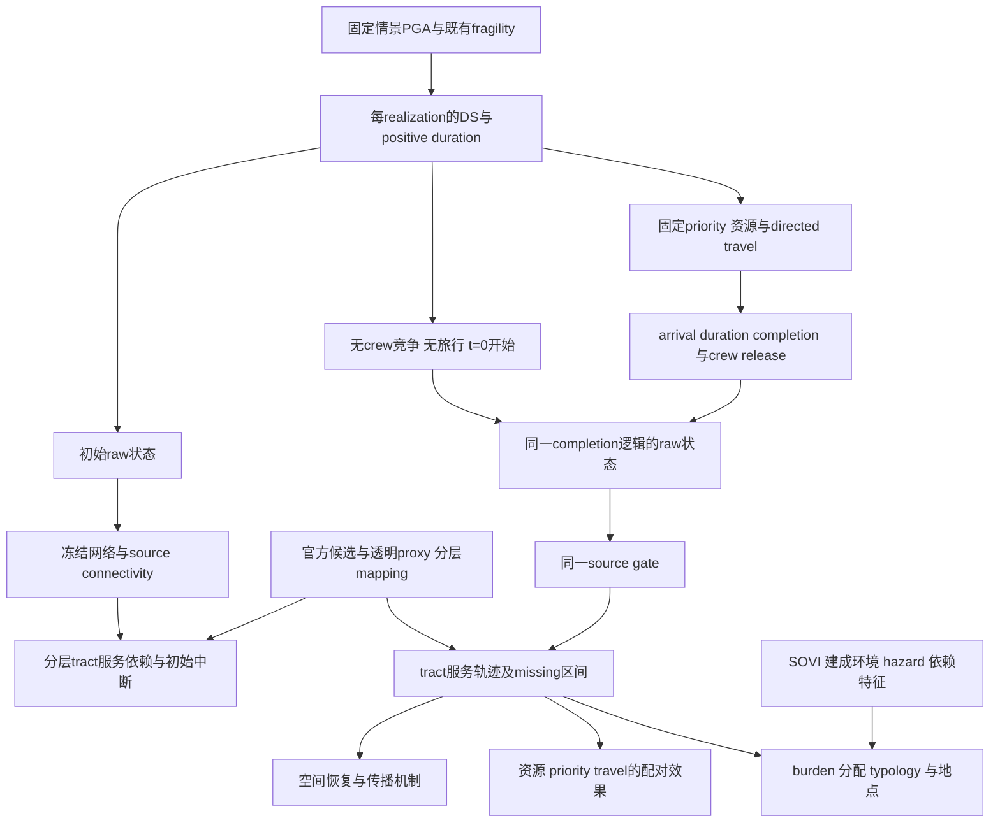

# 中期科学设计收敛：以三条原始研究主线组织最终修订

日期：2026-09-19。读取基准：`84e7865b695aabd6fa7f0a8a4c04fe672892a48e`；已完成的补强科学证据：`87110dad035ddb6eb694235330cd2547d9ba5588`。

**本文件是供作者一次确认的最终设计建议，不是新计算的授权记录，也不是已经完成这些实验的结果报告。** 本轮仅阅读原稿、原始comments、定向源码及保留结果，计算冻结概率的任务／工时期望，检查保存证据的字段与计时记录。没有运行damage draw、scheduler、source gate、recovery、GA或mapping构建；没有修改任何论文、科学代码、序列或原结果。唯一新增文件为本计划。

## 决策摘要

**保留原稿的三条主线：损伤传播、物流约束恢复、社区恢复—脆弱性类型。** 分配指标用于深化第三条并连接第二条，不能代替第一条的网络／空间机制，也不能代替第三条的地图和类型描述。R2 #4确实认可原来三个问题；把它们缩成四条固定序列的指标比较，不是reviewer要求。

建议最终采用**有证据分层的区域hybrid架构（下文A2）**：恢复原2,315-tract研究框架；SCE有据域保留官方候选及A/B/C，不回退旧IDW；其它区域保留透明的上游网络可达性proxy，并显式标记证据与模型覆盖。它不是“恢复全LA实测供电模型”，也不保证2,315个tract都有可解释的数值结果。地区研究问题恢复，未知区域仍在图上，而不是以填值取得全覆盖。strict-SCE是必须单独报告的证据较强子域，不再自动成为唯一研究域。

建议主实验为**六个有不同含义的决策原型 × 三个资源条件**，而不是恢复旧七规则或保留三个近似重复的加权GA标签。六个为network-first、population-first、hospital-first、vulnerability-informed、community-objective GA、单条固定随机参考。资源建议为C30／C57／C120，依据约300个任务的约10／5.27／2.50个任务每crew解释；不声称真实staffing，也不把“充裕”称无约束。

GA推荐直接最小化规划样本上的**source-gated人口累计负担＋小而显式的makespan代价**。保留best-so-far、确定性incumbents和多seed。旧32套physical realizations进入开发／规划证据，不再承担新设计的独立确认。最终策略冻结后，另用32套新physical realizations做所有策略、资源及指定对照的配对评价。32是有边界的确认性pilot规模，不是统计功效保证。

恢复unconstrained baseline、损伤／初始中断／恢复空间图与描述性typology。**不恢复旧的mean-duration双时钟、无据mapping填补、退化GA输出、SVI-T80等于公平、旧92节点数值、任意top-10综合分数或现实因果故事。** 历史地震场作为不同空间激励的补充情景保留；历史restoration milestones只作时标背景。

完成这些工作后，论文应回答：在所表示的网络、服务依赖、任务工时与资源条件下，损伤如何形成空间负担，资源和优先顺序如何改变它，哪些类型的社区获益或承担代价。不能承诺实际LA停电预测、全市utility派工建议、公平最优或Pareto前沿。

---

## 1. Frozen scientific backbone：冻结问题，不冻结预期答案

本次直接读取原始审稿记录[E1]。保留原稿`LA_Grid_Manuscript.docx`的SHA-256仍为`3dc7de9e27bb0f676ca56554cd6fa1d8becfa77732066ecf4193405c24fcb1dd`，其保留文本[E2]第132–135行的三个问题分别为：

1. earthquake-induced substation damage和source-gated connectivity如何转化为tract disruption／recovery；
2. utility-yard logistics、crew constraints和priority如何影响population与critical-service恢复；
3. 哪些tract长期或脆弱性放大地承担负担，如何用recovery–vulnerability typology刻画。

这个保留稿不能被冒称已经核实字节一致的最终投稿PDF；但三个问题与R2 #4的原评语及本轮作者指定一致。最终正文沿用这三个问题的实质，修改“实际供电／脆弱性造成恢复慢”等超过证据的措辞。

| 主线 | 必須给出的证据链 | 不足以代替它的东西 |
|---|---|---|
| RQ1 损伤传播 | hazard／DS空间分布 → 可用源与功能路径 → 初始社区中断 → 无crew竞争基线 → 空间恢复及模型内分解 | 四个strategy总排名；一张抽象workflow；只报告gate存在 |
| RQ2 logistics-aware recovery | 任务与工时 → crew calendar／旅行 → 完工 → 网络／服务恢复；资源×priority的配对交互 | 仅C57的一张T80表；只给总travel；声称GA天然更好 |
| RQ3 community recovery／typology | 高负担在哪里；哪些社会／建成环境／依赖特征共同出现；不同决策改变谁、改变多少 | 单一Gini、Q4−Q1；不含地点的均值；旧热点排名 |

冻结的是对象、信息集、比较和解释层级。结果若显示资源作用小、network-first不占优、GA未超过incumbent或高SOVI不慢，都应成为答案，不因此更换主线、权重或样本。新事实错误可纠正；普通结果变化不是重新设计的理由。

## 2. Reviewer-to-model matrix：全部23条和总评

分类：①底层逻辑；②数据／mapping；③uncertainty；④optimization；⑤experiment design；⑥interpretation；⑦organization。多分类不表示要逐项增加模块。“直接要求”与“为回答问题建议的设计”分开。

| 原评论 | 分类 | 原本关切 | 最终处理及其依据 |
|---|---|---|---|
| R1总评 | ②⑤⑥ | 社区连接有价值，但假设和验证不足 | 保留三条主线；证据、假设与验证范围分层，不以软件通过替代科学支持 |
| R1 #1 | ②⑤⑥ | IDW缺真实服务依赖支持；要更强validation或超出cutoff的robustness | A2分层hybrid＋SCE外部候选一致性／结果对照＋已有A/B影响对照。没有要求全市真实feeder，也没有授权把proxy说成供电事实 |
| R1 #2 | ①②⑥ | connectivity忽略功率、容量、源可用性等；什么条件下可作proxy | 保留gate与网络分析；增加raw／threshold／source-path分解，明确非binding电力约束是适用条件而非已验证事实。不强造潮流 |
| R1 #3 | ①③⑤ | realization damage与mean-duration调度不一致；任务／工时不确定性怎样传到排名 | 已修复逻辑全部保留；未来规划／评价样本分离、策略／资源／指定工时对照配对；不能退回旧双时钟 |
| R1 #4 | ②⑤⑥ | 历史时标可作context，不是tract validation | 历史ground-motion情景可保留在补充材料；删除验证性用语，不删除历史情景研究本身 |
| R1 #5 | ⑤⑥ | SVI-T80不是公平；引入group gap／inequality或收窄主张；K-means／top10是descriptive | 保留新的分配统计，同时恢复空间typology；不以聚类证明因果；替换任意top10综合分数，不把整个社区分析删掉 |
| R1 #6 | ④③⑥ | GA参数、重复seed、收敛和权重20依据 | 保留archive／incumbents；新目标多seed／固定预算／完整历史；所有价值权重明确为设计系数 |
| R1 #7 | ④⑤⑥ | HF胜GA-HospFirst为何；fitness与T80/AUC的区别 | 旧差异已因候选纠正而改变，旧解释不能继承；新GA直接包含community burden，并分别比较自己的目标、各评价指标与incumbent |
| R2总评 | ②⑤⑥⑦ | 方法罗列、网络缩减不明、发现不深；真正问题是决策造成什么社区差异 | 三主线连成损伤—过程—地点的证据链；精简方法介绍而非删除科学问题 |
| R2 #1 | ⑦ | Introduction太短，动机与literature组织不清 | 重组叙事即可，不要求删除network、baseline或typology |
| R2 #2 | ⑥⑦ | 相对于前人，研究缺口和价值在哪里 | 用三条RQ的联合比较证据建立贡献；文献差异需依据原文，不能用“整合模块”充数 |
| R2 #3 | ⑦ | 常规方法过长，移appendix，连接不清 | 常规算法参数移补充；保留理解传播与调度所需公式；不是要求移除实验对象 |
| R2 #4 | ⑤⑥ | 三个问题有用，但答案浅 | 本次恢复并深化三RQ的直接依据；补空间、机制、资源交互及社区类型 |
| R2 #5 | ⑦ | Table 1 excellent | 保留并更新参数／数据／假设表，不能借此宣称参数已验证 |
| R2 #6 | ⑤⑥ | 为什么识别critical substations，与目标有关吗 | 不保留独立“最关键站top榜”；network priority和瓶颈解释必须连接社区服务后果 |
| R2 #7 | ⑥⑦ | normalized percolation与meshing表述难理解 | 简化为实际损伤下的source-connected变化；抽象percolation可移补充或移除，不能因此删拓扑图／传播分析 |
| R2 #8 | ⑦ | sequencing／crew语句笔误 | 文字修正，不触发模型更换 |
| R2 #9 | ④⑥⑦ | 黑箱GA为何可信，算法细节是什么 | 透明permutation搜索、确定性规则基准、best-so-far、多seed、直接community目标；不声称GA方法创新 |
| R2 #10 | ⑤⑥ | 也许SVI/community是重点 | 是聚焦社区结果的建议，不是要求新造SVI或取消损伤／物流链 |
| R2 #11 | ②⑦ | 原网络多大，为何92／318 | 保留已补的486历史候选缺口、4260→310链与310／1040图；不恢复旧92输出 |
| R2 #12 | ⑤⑥ | 结果显然，具体发现是什么 | 从“谁第一”转成damage／path／queue如何对应空间负担，资源如何改变局部分配。答案不预先设定 |
| R2 #13 | ①⑤⑦ | limited resources到底怎样起作用，解释不清且不新颖 | crew限制已有正确实现；因原RQ2保留，建议三个资源条件实测交互。三条件是本计划设计，不是reviewer点名数量 |
| R2 #14 | ⑤⑥ | targeted／equity-informed planning改善谁、代价及承担者 | population-first与只改变脆弱度因子的规则形成可解释对照；同时报告绝对群体负担、地点、物流代价。仍不称公平最优 |
| R2 #15 | ⑤⑥ | “工时管时标、拓扑管稳健性”结论空泛 | 已有DS4证据否定简单二分；每个对照对应具体community claim，不做参数大拼盘 |
| R2 #16 | ⑤⑥⑦ | 应回答决策如何使不同tract不成比例受影响，不是方法好坏 | RQ1给基线与机制，RQ2给干预，RQ3给who／where／cost，三者共同回应 |

**原评论、实际发现、AI建议不得混同。** Reviewer没有直接要求best-so-far代码结构、A2、六策略、三crew、32新样本或规则型typology；这些是本计划为可靠回答问题而提出的设计。已确认的candidate retention缺口和NA分类错误有实际代码／结果证据。删除全部空间／typology／资源问题则是此前AI与修订选择，不是reviewer命令。

## 3. What is already fixed：不再退回的修正

| Git／证据 | 保留内容 | 不能随之误认已经解决的事 |
|---|---|---|
| R1 provenance／local closure；`84e7865`文稿说明 [E3] | 310 inventory、306 identified、302主component任务资产；固定图310节点／1040边；保留旧选择不可恢复的历史 | 不是complete LA电气系统；图长／电压不是capacity |
| `8996b12`及后续service实现 [E4] | 官方SCE候选、A/B/C、独立missing、W1质量不再分配 | named-system不是验证接线；等权不是份额；B自身配电损伤未建模 |
| `475eacc`、`beb1ad7`、`ef46d9e` [E5,E6] | DS>0任务、realized positive duration、earliest-release crew、strict directed travel、completion single clock | completion-step是仍需明示的建模假设，不是reviewer指定的唯一维修物理规律 |
| `1d1015f`，由`87110da`纠正／补强 [E7,E8] | 策略间DS／duration配对；累积负担、Q组、Gini、uncertainty、winners／losers | 32已有样本不是新目标的独立验证；旧最后代候选的结论不继续当最终证据 |
| `87110da`的`run_ga` [E9] | archive不参与replacement／不消耗RNG；保留best observed、比较确定性incumbents；保存来源 | Balanced／HospFirst来自可重建初始化；没有找回所有未存中间染色体，没有全局最优保证 |
| `5f998ed`后处理、`87110da`最终表 [E8] | 12个全未知tract单列unresolved；NA方向概率；两个人口分母；±1 h实用而非显著性阈值 | NA不是无影响；全域扩展后未知tract总数需要重新列示，不能仍只写12 |
| `87110da`两项对照 | 固定决策A/B影响压力、同DS的DS4工时×2 | 只支持已测序列／C57／原SCE域；不自动支持新策略、区域mapping或所有crew条件 |

保留概率表的局部正则化披露：先前评估已经量化五站的exceedance crossing，最大单cell截零／归一化修正约0.00192个百分点，负质量合计约5.75×10⁻⁵。它不是纯机器精度误差，也不是全hazard模块失效的证据；不据此重新设计fragility或重抽旧样本。未来历史场若重新计算概率，须处理该场对应的有序性，不能把2pc50的局部检查外推到所有PGA。[E9]

### Single clock的最终建议

保留completion-step作为主模型：任务前保持DS residual，到完成同时crew release和raw=1，再单独gate。它最少引入没有证据的维修进度参数，且便于解释arrival、occupation和恢复时点。

可行但**本次不推荐**的替代是同一任务内按进度`g((t−arrival)/duration)`恢复，crew仍在同一completion释放。它必须使用同一个duration、不能arrival前恢复、不能另抽CDF时钟；还需现场任务进度—功能的依据。目前没有这类数据。Reviewer要求的是一致性，不是step优于所有渐进恢复。没有新事实，不因某结果不理想再换step／ramp。

## 4. What was over-corrected：哪些方向需撤回，哪些删减仍有理由

1. **把SCE-only等同最终唯一问题域：过度收窄。** 原2,315域有9,066,522人；817 strict-SCE有3,572,152人，只占39.40%，未覆盖区域最高PGA尾部。其有据程度较高值得保留，但不能据此替换原区域问题。[E4]
2. **把原三RQ换成四序列比较：过度收敛到现有输出。** R2 #4的正面评价与此相反。当前群体发现继续保留，但只是新三主线中的一部分。
3. **删除unconstrained、损伤／恢复地图及所有typology：没有相应reviewer要求。** 应更新不一致的旧数值与因果表述；不是删除分析问题。
4. **撤回资源稀缺问题：曾是缩scope选项，不是逻辑修复。** 既然作者明确保留crew resource的RQ2，单一C57不能完整回答，现在需要资源对照。
5. **删除全部network／population／vulnerability规则：没有科学必然性。** 可以删除高度重复centrality规则，但不同规划目标应有代表。
6. **删除历史情景本身：混淆了hazard context和validation。** R1 #4只限制后者。
7. **以下删减仍合理：** 旧92节点排名／热点数值、无明确决策用途的percolation／criticality大篇幅、旧综合top10评分、GA最优和公平因果措辞。恢复科学主线不等于恢复所有旧图。

### 对原16类结果逐项处置

| 原内容 | 原来回答什么 | Reviewer是否批评本身／实际要求 | 处置 |
|---|---|---|---|
| 1 network／topology map | 哪些资产与路径构成传播域 | R2 #11问规模来源；#7问解释，不是禁用地图 | **retain＋update**，显示310／302、sources、missing及图的抽象性质 |
| 2 seismic damage map | 强度与DS空间分布 | R1 #3要求不确定性一致；无人要求删除 | **update**为302概率／配对损伤摘要，不挑单次“好图” |
| 3 source-connectivity propagation | 损伤如何放大到服务 | R1 #2限制电力含义；R2 #16要求联系社区 | **deepen**，raw／阈值／path机制连接tract，不止LCC曲线 |
| 4 unconstrained recovery | 无crew竞争时的空间基线 | 未批评保留本身；旧时钟需一致 | **update**为同realization duration、t=0同时开始、无旅行的理想下界 |
| 5 tract recovery distribution | 谁恢复慢、分布尾部 | R1 #5要求不等于公平 | **retain＋deepen**，burden／T80及不确定性、NA分开 |
| 6 tract recovery spatial map | 慢恢复在哪里 | 未要求删除；R2 #14/#16正需要where | **retain＋update**，证据层与unknown叠加 |
| 7 repair yard／crew map | 资源从哪里到任务 | R2 #13要求解释资源 | **retain／compress**入研究区图，标scenario allocations非实际crew |
| 8 logistics strategy comparison | priority的社区／物流后果 | 批评浅排名和限制不明 | **deepen**为资源交互、travel／queue及局部分配 |
| 9 population priority | 面向人口的目标基准 | 无删除要求 | **retain＋update**，与新mapping同信息集 |
| 10 hospital priority | critical-service目标 | R1 #7需公平比较与目标解释 | **retain**，hospital-tract proxy而非运营能力 |
| 11 network priority | 结构目标与社区目标差别 | R2 #6要求与主问题有关 | **retain一种**source-connectivity规则；移除重复degree／closeness榜 |
| 12 GA strategy | optimization comparator | R1 #6/#7、R2 #9质疑透明性／目标 | **update**直接community目标及独立评价，不换新算法求novelty |
| 13 community typology | 恢复与社会／环境特征共同出现 | R1 #5明确允许descriptive | **retain＋redesign**，可解释类型替代盲目恢复K-means |
| 14 hotspot map | 定位多重不利组合 | R1 #5限制causality，不要求取消空间筛查 | **update**为高负担×高SOVI筛查区；移除任意总分top10 |
| 15 sensitivity | 哪些假设改变哪些结论 | R2 #15要求科学含义而非参数列表 | **retain selective**，mapping／DS4／crew各绑定claim |
| 16 historical scenarios | 不同空间激励与时标context | R1 #4反对把milestones作validation | **retain in supplement**；2pc50主文；旧历史数值不直接复活 |

## 5. Recommended final architecture

这里的unconstrained与logistics是共享物理实现的两条对照分支，不是先算一次无约束恢复，再把另一时钟叠加上去。

共同底层仍是310 inventory／302任务资产、同一个21源reference情景、严格道路、相同raw残余和completion逻辑。**扩大community观察框架不自动扩大任务域、不自动激活8个非任务记录的damage／repair。** 这些记录在区域mapping中的关系须明示为固定背景、未表示的动态恢复或未识别，而不能被包装成与302任务相同的随机修复对象。

## 6. Mapping decision：推荐A2，但不是未经区分的拼接

### 6.1 三架构比较

| 标准 | A1 全域统一proxy＋SCE外部子集 | A2 有证据分层的hybrid | A3 strict evidence-supported子域 |
|---|---|---|---|
| 原区域问题 | 保留最直接 | 保留区域框架；明确域内不同证据与unknown | 缩到817，不能独自回答原区域空间／typology问题 |
| 对已获官方关系的利用 | 作为外部检验，但主结果可能继续使用已知不一致关系 | SCE直接采用官方候选，非SCE承认proxy | SCE采用官方候选；仍有B、等权与C假设，不是真实feeder全验证 |
| R1 #1回应 | 有独立候选检查，但结果已显示部分不一致，不能称整套proxy验证成功 | 利用较强证据、保留可比较proxy影子层；分开membership／share／outcome检验 | 改善subset依据最强，但靠删掉大部分区域不等于验证原区域mapping |
| 独立性 | 候选重合率不等于服务份额误差；不能用SCE拟合后仍称holdout | 官方约束用于建模的SCE部分不是独立验证样本；影子proxy的外部一致性单独报告 | 不解决非SCE；不证明SCE等权或B自身损伤可忽略 |
| community类型完整性 | 区域可覆盖，但类型可能受proxy偏差主导 | 可恢复regional描述并显示证据分层；不跨tier暗中比较实证可信度 | 遗漏848 LADWP及650 other／ambiguous tract |
| 成本 | 需重新冻结priority／评价；旧92映射不可恢复 | 静态重组较多；已保存R1轨迹可复用；无需重建物理网络 | 最低，但这是工作量优势，不是科学最优性 |
| 判断 | 保留为统一proxy的对照层，不推荐忽略官方证据作为唯一primary | **推荐** | 保留为必须单报的证据较强子域／外部锚点，不作唯一研究框架 |

这一推荐改变09轮对“统一LA服务曲线”的否决范围，但不否定其理由：**把不同设施层级当作同等可信的实际供电再合并，仍不可接受。** 本建议统一的对象是“所表示上游网络的候选可达性”，并同时分域报告；它不统一claim为真实distribution service。

### 6.2 证据基础与不能跳过的差异

08／09轮已有静态证据：2315 tracts共9,066,522人；SCE 817／3,572,152，LADWP 848／2,954,842，other／ambiguous 650／2,539,528。旧R1 proxy在817 SCE tract中top1命中549、top3额外命中126、142不命中。82.62%有top3重合**不是82.62%权重或客户归属正确**。这些是公开候选一致性检查，受epoch与crosswalk局限，不是实际outage误差。[E4]

SCE当前层为113 A、71 B、12 C；B承接上游而不独立抽配电损伤，A同资产只计算一次。LADWP保留资料只有2个确认DS、15个有角色支持的RS等，不能据此重建全市DS→tract。54个旧baseline异常也不能被重新叫作真实长期停电。已有这些事实，既不能宣称全域proxy无问题，也不能认为研究区域之外不值得描述。

### 6.3 具体冻结方式

1. **地理frame仍为原固定2315 tract union**，不是整个LA County的完整人口。所有地图显示同一边界；是否有数值结果另列覆盖表。
2. SCE817使用当前官方candidate＋A/B/C＋原W1。不能因扩域而用proxy填补12 C或改变B的证据标签。
3. 非SCE主proxy建议复用06轮`R1_310_CLOSURE_DATA.npz`中按显式IDs保留的区域`W`，不是旧92节点W；SCE同一份R1 proxy作为影子对照。由role ledger标明设施层级，记录原候选／距离规则，utility边界用于证据分层，不凭utility标签新造未证实的跨界禁线。无需另外拟合一套让候选命中率更好的距离模型。RS可被标成上游interface proxy，不能因此升级为真实DS服务归属。原W中不可表示的质量按以下规则保留，不能为“修好baseline”重分或nearest-fill。
4. 未识别R1保持missing；有识别但reference-source unreachable仍为identified zero，不能靠把它删掉／nearest-fill使baseline=1。动态任务域以外的interface另列“未纳入本次随机恢复域”，不把其固定背景状态计为已经修复或迅速恢复。
5. 固定权重不会因某次damage、source断开或missing而重分。官方C、proxy无依据部分、非任务域覆盖分别标记，不能合成一类“故障”。
6. 报告至少分SCE A-only、SCE含B、SCE部分／全部C、LADWP proxy、other／ambiguous proxy。全区域汇总只能叫明确人口加权的**regional modeled index**，并同时列tier贡献和分母；不能替代这些分域结果或代表全部9,066,522人的实际恢复。

**区域扩展的一个实际边界必须先说明，而非事后补零：** 如果proxy的无损reference仍有永久source-unreachable质量，原`∫(ResolvedMass−Lower)dt`会把这种结构缺口乘以各策略不同的horizon，混入不可修复的baseline差异。应单列reference gap，并对动态恢复报告`B_event=∫[L_ref−L(t)]dt`，归一化分母为固定、已表示的reference-available质量。恒等式是`B_total(H)=H(R−L_ref)+B_event`。reference质量为0或动态恢复完全不在任务域的tract保留NA恢复指标，不当作零负担。SCE现有有定义结果中`L_ref=R`，所以此约定与当前burden一致，不修改旧SCE结果。此步骤是扩域的必要estimand定义，不是用source-reachability重新选择真实服务站。

部分tract同时依赖D302与非任务域时，应分别列出两部分原始权重质量。恢复比较的`L(t)`和`L_ref`只针对事前定义、此次确实表示动态恢复的部分；非任务域的固定背景状态另报，不能以其恒定为1稀释该tract的恢复负担。此为分析纳入范围，不是重分配权重，也不将非任务域等同于state missing。人口加权的tract-normalized量只能解释为该tract**被表示部分**的平均proxy负担；另一个population×represented-mass量按表示质量加权。两者均须披露覆盖，不能据此推定所有居民实际经历相同时长。

### 6.4 Mapping的最小对照与决定边界

- SCE上将统一proxy影子层与官方候选层比较：候选membership、依赖集中度及同一R1轨迹下的burden差异；先按相同可表示质量／共同域比较，再另报coverage损失，不能把换分母当mapping效应。所有817已被检视，称外部一致性而非未见holdout验证。
- 继续A/B λ=0.5、1、2，保留C与总resolved mass；它只检验SCE内部相对候选影响，不能包办非SCEproxy不确定性。
- 对区域结论给SCE-only、各proxy层及regional index并列表。若结论由弱证据层驱动，就按该假设限定，不回到只挑支持结果的地理域。
- 这些评价对照固定sequence／DS／duration／crew，只改变结果映射，可由完整R1积分离线完成；不重算priority／GA。主A2冻结时重建priority是必要的一次政策信息集改变，与事后mapping评价对照分开。
- 不以候选重合率“足够高”作为现实有效性的通过阈值，也不因新组关系翻转再调权重。若非SCE某部分始终无可解释上游代理，该部分留在地域图中为unsupported，不能承诺数值填满全图。

## 7. Abstracted network与RQ1的最终结果结构

### 7.1 它能回答什么，不能回答什么

当前gate在raw≥0.5的功能子图中保留含active reference source的component。它回答路径和资产功能共同允许的上游可达性，并能展示源、interface及中间节点修复对社区代理状态的影响。不能回答MW需求满足、线路／变压器热限、reactance、voltage、保护、切换、发电出力与配电自身损伤。

保留graph edge表含`src,tgt,length_km,component,path_wkt...`，不含可用于DC/AC或max-flow供需评估的完整容量／阻抗／注入负荷参数。[E3] 站电压、source角色或附近电厂容量不能直接当成该抽象edge／injecting terminal的容量。因此**不建议现在增加“简单capacity screening”**；没有可比MW供给、荷载、线路／变压器瓶颈，做出来的可行性将由新臆设决定。已有role、voltage、路径与epoch证据可作有限结构合理性说明，不是physical validation。共同proxy不保证相对strategy偏差抵消。

### 7.2 RQ1最小结果链

| 结果 | 用什么 | 应回答什么 |
|---|---|---|
| Hazard／damage map | 固定PGA、P(DS)、32评价样本的DS／functional loss汇总 | 损伤暴露在哪里；2pc50是固定hazard field而非单一rupture |
| Network initial impact | 同一初始raw下active sources、source-connected比例及非源component地图 | 本地损伤与路径／源切断是否集中在相同地点 |
| Initial tract disruption | 同一hybrid候选权重下`L_ref−L(0)`与unknown | 哪些tract起始损失大；所有strategy的初始状态应相同 |
| Unconstrained recovery | 同一DS／duration，全部task在t=0开始、无旅行、无crew竞争，completion=duration | 即使没有物流竞争，仍有哪些空间负担差异 |
| Spatial recovery | 32次mean／interval的tract burden；T80未达到为censored/NA，不填horizon | 哪里慢，哪些地方结果不稳定或不可识别 |
| Model mechanism accounting | raw、功能阈值、source-connected effective及固定依赖权重 | 哪些负担来自本地未恢复、哪些来自上游路径尚不可用 |

unconstrained是理想操作下界，不是现实“有无限crew仍要跑道路”的情景，也不等于C120。它继续使用single clock和同一DS残余，不能恢复旧mean-CDF基线。对固定非负权重、同一网络和恢复单调性，它的每task完成不晚于有限crew方案；但不要将任意两个有旅行／无旅行list schedules的逐tract差都预先规定为非负。

### 7.3 可证明的机制分解

对reference内可表示的interface，在同一event grid定义raw `x_i`、本地功能资格`f_i=x_i·1[x_i≥θ]`、effective `e_i`。则

`1−e_i = (1−x_i) + (x_i−f_i) + (f_i−e_i)`。

三项依次为raw residual deficit、本地功能阈值排除、已具本地资格但未连活动源的额外deficit。对静态candidate权重加总并按event-step积分，得到tract burden accounting。Class B的第一项仍是其上游interface的raw deficit，不是B配电站自损伤。unresolved不进入这个数值分解。若reference并非1，先按6.3分离reference gap。

可以另把“已恢复但无源path”的区域显示出来；某task完成时有多个tract解锁是模型内时间证据。**不能仅由一个节点的积分贡献把路径阻断归给该节点，也不能把分解说成三个独立可加的现实干预因果效应。** 若要单独移除某机制，需要另行固定其它条件的模型对照；本计划先使用上述精确accounting，避免无必要的counterfactual大拼盘。

## 8. Strategy set：六个主原型，一个共同信息集

所有序列都是同一task domain的full ex-ante permutation，未来仅删除DS0；不根据实际duration排序。所有规则使用冻结规划信息，不看确认性32样本结果。mapping／分母先冻结，再一次性重建规则输入，不能沿用SCE priority却把目标写成全区域。

| 原型 | 事前规则／目标 | 独立科学意义 | 边界 |
|---|---|---|---|
| Network-first | 固定reference图中，单节点失效造成source-connected identified节点数减少，降序；ID打平 | 只关心可达网络功能，和人口服务目标形成可解释比较 | 这是模型静态一节点重要性，不是capacity或多损伤最优；不叠加旧role／voltage／line数主观blend |
| Population-first | 由最终依赖层汇总的population priority降序，ID打平 | 面向人数的服务目标 | 表示的candidate mass，不是客户MW |
| Hospital-first | binary hospital-tract priority，继而population，再ID | critical-service targeting | 不因同tract医院数多重复放大；不等于医院运营恢复 |
| Vulnerability-informed | 与Population-first相同的构造，仅将tract人口乘固定非负NRI-derived SOVI，再ID打平 | 可隔离“加入脆弱度权重”这一决策变化，与population规则直接比较 | 不是公平最优；分数是设计信息，不证明社会因果 |
| Community-objective GA | 第9节推荐的直接community＋logistics目标；比较全部固定规则incumbent | 检验优化与规则差异，并诚实报告有限预算的增益／不足 | 如果最终选中incumbent，就称incumbent被保留，不冒称GA创新 |
| Fixed random reference | 在规划阶段用独立seed冻结一条302-ID permutation，所有realization／crew共享 | 无目标排序的参考 | 只代表一条随机顺序，不能推论所有random policies的期望表现 |

这不是原七策略的机械恢复。degree、closeness、betweenness等相似centrality不各占主实验一列；Balanced／HospFirst初始化与旧Efficiency可作为GA incumbents／历史补充，而不是自动保留三条GA主策略。Network-first单节点移除分析属于未来规划静态计算，不在本轮执行；其大量平分若确实存在须如实记录，不根据后续community效果另换中心性。

未来规则与优化都看同一预测分布／道路／crew／mapping；实际DS在dispatch开始时知道，用于删除DS0。GA看的是独立规划样本中的模拟工时分布，不看将用于评价的actual realized vectors。这与“禁止优化偷看未来执行duration”一致：一个共享的π必须先冻结，不能为每个评价样本重优化。

## 9. GA objective design：比较三种，推荐Option 1

设规划样本`s`上通过同一event scheduler→raw completion→gate→service计算人口availability-consistent累计负担`B_P(π,s)`、医院tract平均归一化负担`B_H`、Q4绝对负担`B_Q4`、makespan `M`。均用固定可表示质量和分母；医院与Q4不是实际停电小时。`T*=504 h`只作固定归一化单位，不截断积分或未完成任务。

| 方案 | 目标示意 | 是否直接community／是否需要surrogate | 成本、意义与本次判断 |
|---|---|---|---|
| 1 人口＋物流 | `J1=E_plan[B_P/T*]+0.10·E_plan[M/T*]`，最小化 | 推荐直接跑source-gated community积分；不再以静态priority×completion替代 | 单目标，最容易解释优化和报告对象的关系；0.10是公开设计交换率：1h人口累计proxy负担与10h makespan等价，不是社会偏好估计。**推荐主GA** |
| 2 人口＋critical service＋物流 | `J2=αE[B_P/T*]+(1−α)E[B_H/T*]+0.10E[M/T*]` | 同样直接；α须先声明，不能以让HF输为选择依据 | 增加hospital目标，但Hospital-first已提供有意义critical-service基准。若主张hospital/community联合优化才需这一额外目标；本次不增加第二GA |
| 3 人口＋脆弱群体＋critical service＋物流 | `J3=aE[B_P/T*]+bE[B_H/T*]+cE[B_Q4/T*]+ηE[M/T*]`，或明确的group约束 | 直接；仅提高SOVI权重的completion surrogate不等于直接优化Q4 | 如要隔离targeting，必须相对1或2只改一个预先定义项。使用Q4绝对负担不自动代表公平；若要求gap最优需额外约束／解释。当前收益不足以支持再开多目标搜索 |

三方案无需一定使用Pareto算法。六个原型的cost–burden散点是有限决策点，不是效率—公平前沿。通过Population-first／Vulnerability-informed这一更简单的单因素规则对照，加上直接community GA，已经能回答targeting改变谁及代价，不能借此声称找到公平规划最优收益。

### 9.1 搜索、样本与候选保留建议

- 旧32样本已经影响设计判断，明确作为**planning／development pool**。机械固定IDs 0–7供GA搜索；用完整旧32对各seed最佳与规则／旧候选incumbents作最终规划评分。不能把后24叫新独立验证。
- 只优化C57的一条π。C30／C120使用同一π，检验资源改变下固定决策的表现，不是各资源条件下重新寻优后的上限。
- 建议固定预算：population 40、40 generations、5 seeds（42–46）、ordered crossover 0.8、inversion mutation 0.2、tournament 3；停止为预算结束。比旧surrogate预算小是因为每次fitness直接评价8个sample，不是已知收敛更快。冻结后不按中途排名调budget。
- 保存每seed best-so-far序列／score／generation、generation-best和mean、incumbent来源，以及完整旧32 planning-score。最终按最低32-sample J1、再最小seed／稳定ID序列打平；这不是全局最优。
- 容许GA未改进任何incumbent。方法比较应展示自己的J1和population、hospital、Q组、makespan、travel，不能把不同目标fitness跨行比较。
- 最终mapping、规则、GA与crew roster冻结后，才生成32套独立确认性DS／duration。共用所有策略／资源／DS4对照；planning与evaluation的seed命名空间不重叠。

### 9.2 不隐藏计算成本，也不以surrogate另造黑箱

直接照搬旧100×100×10 seeds、8 planning samples约需808,000个sample–candidate评价；当前保存192条完整链中位耗时约4.82 s，这一外推约45天串行，不能称为低成本。上述40×40×5×8上限65,600个sample–candidate评价，另最多约416个候选复评分；照现有全输出driver仍约88小时串行。它们是**规划fitness评价**，不是65,600套独立物理draw，更不能隐去这部分科学计算成本。

推荐用同一物理规则的轻量**精确**fitness计算：event scheduler／source gate照用，利用固定mapping可预聚合的人口质量和上游deficit积分计算目标，不在每次fitness构造导出CSV、所有tract时间长表或重复读取磁盘。保存正式入选序列的完整轨迹。该代数压缩保留source门槛与组合依赖，不是旧线性completion surrogate，也不预测新物理状态。

未来实现时用规划样本的少量固定候选确认精确目标与完整driver一致、记录实测速度即可；不再开adapter／mask／scheduler基础QA轮次。本轮没有运行这个计时试验，实际加速不作保证。若成本必须进一步降低，应在新GA开始前一次调整预算并公开，而不是看到结果再多跑seed。

若坚持用学习型或静态surrogate，至少要在未用于拟合的planning candidate集合上报告objective误差、rank consistency、是否误选比incumbent差的序列，并让最终候选通过精确目标；该工作本身可能超过精确方案，**目前不推荐**。最终32样本不能用于训练或调surrogate。

## 10. Resource design：保留资源问题，需要三个预声明条件

仅解释C57有限不能回答“稀缺程度是否改变priority的社区后果”。本轮从冻结302×5概率表计算，未抽样：

`E[Ntask]=Σ(1−P_DS0)=300.44698`；`E[Work]=Σ_iΣ_d>0 P_i(d)E[T_d|T_d>0]=7,342.73897 crew-hours`。

| 建议资源条件 | crews | 预期tasks／crew | 预期现场work／crew（h） | 含义 |
|---|---:|---:|---:|---|
| Scarce | 30 | 10.015 | 244.758 | 约十任务／crew，明显多轮排队 |
| Reference | 57 | 5.271 | 128.820 | 保留已有pooled reference budget，便于与已确认执行语义衔接 |
| Abundant | 120 | 2.504 | 61.189 | 约2.5任务／crew，仍有竞争，不是无限crew |

`E[Work]/C`是总现场工作量除并行crew的下界量，不是预测makespan；另有最长任务、旅行、离散分工和队列不均。参考2pc50样本平均task 300.469（298–302），说明该主场景几乎全域受损，不能把资源结论外推到稀疏损伤；历史场景可提供context。

旧29／114对应约10.36／2.64任务每crew，也能形成相近regimes，**没有错误**。本计划独立依据D302工作量推荐整十预算30／120，不宣称比29／114更真实，也不同时运行两套近似资源组合。所有roster按C57十一origin比例作largest remainder、yard ID稳定打平；不新增depot或utility资格约束。新roster仅为计划，尚未生成。

六条序列在三个条件共享32DS／duration。报告`(policy−HF)_C30 − (policy−HF)_C57`及C120对应交互，同时保留绝对burden／work／travel。若scarcity没有放大某差异，同样是结果。只有固定序列的资源响应被识别；“每种资源下最优政策怎样改变”需要另优化，不在本计划。

### Travel怎样单独回答

每run可分解task的arrival为crew-available＋directed leg，并从事件表展示queue、travel、duration和completion。这是时间accounting，不能仅把total travel当作community delay的因果贡献。建议对预声明Hospital-first、C57的同32样本增加**zero-travel诊断**，保持任务／工时／sequence／crew不变，重新dispatch并传播。它识别该固定策略下旅行及其后续crew重排的模型总影响；不外推到所有策略，也不把arrival差简单归给每一站自己的那段路。

## 11. Community typology：恢复描述性识别，不恢复任意综合评分

### 11.1 推荐方法：事前定义的二维类型＋多特征画像

不以K-means为投稿前提。主文采用**burden × SOVI的可解释类型**，并用建成环境、hazard、initial disruption和dependency描述其画像与位置。两维各低／中／高形成3×3类别；高为固定规划分布上四分位，低为下四分位，中为其余。SOVI由固定区域tract分布定义；burden阈值由planning pool上预声明Hospital-first／C57参考结果定义。threshold和标签在确认性评价前冻结；不能每个strategy重新分位／重新聚类，让改善后仍有固定25%“高负担”。

类型既可展示high-vulnerability／high-burden、high-vulnerability／relatively-fast、low-vulnerability／high-burden，也保留中间类与unknown。策略下的绝对burden、跨固定阈值移动及paired Δ针对同一组tract；**初始被选成高HF负担的一组不能仅凭同样本Δ声称干预因果效果**。用规划参考定义类型、新32评价其后果，可减轻这一选择问题；仍是模型描述。

### 11.2 Feature set逐项判断

| 候选 | 最终用途 | 去重／循环性／解释边界 |
|---|---|---|
| Normalized burden | 类型主轴、空间mean及不确定性 | 主要恢复结果；不要再与高度相关T80／AUC一起反复加权 |
| T80 | 辅助分布／地图或补充 | 需完整trajectory；积分不能反推；未达阈值不填最终时点 |
| NRI-derived SOVI_SCORE | 类型主轴与固定Q1–Q4 | 与旧Stage7 CDC2022多个theme不是同一输入；不混用，也不声称新复合SVI |
| Population density | 类型画像，建议log展示 | 人口／陆地面积，明确面积单位及人口年份缺口；不与总人口重复支配距离 |
| Housing age | 画像：ACS2022 B25034 pre-1970比例 | 文件和四age bins现有；描述建筑年代，不作电网资产fragility或居民贫困因果代理 |
| Building value | 补充画像，若使用按面积／housing单位显示 | NRI BUILDVALUE总量与人口／规模重复；不是住户wealth；当前主类型不使用它决定类别 |
| Hazard／risk | 主画像用情景PGA；地震EAL可作补充context | NRI总RISK含社会／风险复合信息，不与SOVI、PGA一起当独立维度反复计数；EAL也不等于本模型损失 |
| Grid/service dependency | 汇总到唯一upstream后的dependency concentration、候选数、证据tier | 多个B服务节点共享一个upstream不算独立冗余；不能沿用旧degree／HHI输出当新mapping特征 |
| Initial disruption | 模型机制画像 | 已由同DS／mapping生成，与burden相关不算独立验证；不另与多个等价初损变量叠加评分 |
| Network-related exposure | source-path额外deficit、参考源依赖／可达性描述 | 是模型内解释量；与burden共享计算不作外部原因证明 |

旧Stage7源码同时含T80、initial supply、degree／impact／betweenness、HHI、房龄、人口密度、NRI risk／building value及多SVI因子。[E10] 即使已去掉AUC／EAL的重复，它仍混合结果、机制与社会特征，高维标准化距离会隐含权重；不能把旧clusters一键换进新版。

### 11.3 Spatial output与strategy linkage

主输出为参考burden地图、3×3类型图、high-burden/high-SOVI screening区域，以及同一tract在不同策略／资源下的Δburden与方向频率。地图标明确认性32中的不确定性与mapping evidence tier；所有未知显示独立灰纹，不进入“低负担”类。按planning预定义类型汇总受益／延迟人口、Q组绝对负担及物流代价。

不用任意top10总分，也不把统计空间聚集与真实电网瓶颈混为一谈。“hotspot”若使用，明确定义为双高筛查区域，不声称通过空间显著性检验。若作者另外希望无监督分类，可在补充材料用少量非重复变量、robust scaling／medoids或稳定性检验；但这是OPTIONAL，不能为得到漂亮簇不断换K。没有显著独立解释收益，不做。

## 12. 最终指标、配对与RQ2/RQ3解释

继续并列两个合理estimand：人口加权的tract-normalized burden，与按人口×固定represented/reference-available mass加权的累计负担。人口T80使用后者对应的availability分母；Q组、Gini使用明确的tract-normalized对象。区域扩展遵守6.3的reference-gap处理；SCE原指标不变。

报告Q1–Q4绝对水平与signed／absolute gap、Gini，而非只报“更公平”。改善／延迟／near-zero继续±1 h；它不是显著性或等效性阈值。分别报告32次mean effect分类与逐次分类再平均。12个SCE完全不可识别tract始终unresolved，新增区域未知另列；direction probability保留NA。人口占比同时提供全frame分母和该分析有效分母，不暗换。

所有策略／resource／DS4比较以同一physical realization为配对单位，bootstrap不把817或2315 tracts当独立地震样本。固定10,000 paired resamples与独立bootstrap seed，报告效应、区间和方向频率。区域／类型exploratory细分不把pointwise CI变成全图显著性宣称。只在同一metric内给排名频率，不合成“总冠军”。

RQ2应同时呈现：有限crew如何增加等待；travel诊断增加多少；priority怎样改变完成顺序；哪些source-path／service interfaces因此改变；各群体和医院tract的效应；scarcity是否放大差异；GA的规划目标和独立评价分别改善了什么。RQ3则明确who、where和特征组合。较低Gini若来自原低负担组恶化必须直说；也不能将每个high-SOVI获益解释成现实公平改善。

## 13. Sensitivity与historical scenarios：每项只回答一个claim

| 对照 | 对应的未证实claim／评论 | 固定与变化 | 建议等级／边界 |
|---|---|---|---|
| A2 vs统一proxy影子层，SCE共同域；A/B λ0.5、2 | spatial／distributional结论是否依赖未验证的候选关系／份额；R1 #1 | 固定全部physical轨迹和决策，离线改评价层；membership、coverage和share分开 | **MUST，离线**。不声称验证非SCEfeeder，不按新mapping再优化 |
| C30／57／120 | scarcity会否改变priority的社区后果；原RQ2、R2 #13 | 同DS／duration／π，改crew roster | **MUST，主实验**，不与所有其它敏感性做全因子 |
| DS4×2，C57 | targeted决策效果是否依赖severe-workload关系；R1 #3/#4、R2 #15 | 同DS、DS0–3工时、π、mapping；只乘DS4 | **MUST，限定HF／Vulnerability-informed／Community-GA三锚点**。已有旧4序列证据保留，不能代替新锚点 |
| gate阈值0.5→1或源可用性设计压力 | 空间解锁是否依赖具体functional判据／源可用性 | 只能预声明改变一个条件，不能补新sources让baseline通过 | **OPTIONAL**。阈值主要改变DS1资格，不是capacity validation；无需要不运行 |
| 容量／完整潮流 | 相对排名在电力约束下是否成立 | 需要缺失的MW／阻抗／负荷资料 | **不列本次必做**；通过适用范围回应R1 #2，不能写成已验证物理稳健 |

Historical部分建议：2pc50仍是主情景；Northridge、San Fernando、Long Beach的保留PGA字段在D302均302/302 finite，本轮只检查这一静态覆盖事实，未重新计算概率。[E3] 使用这些**历史空间地震动场施加到同一个多年代参考网络**做damage／initial disruption／unconstrained recovery的补充对照，有助于判断空间pattern是否只来自2pc50强场。它不是1933／1971／1994系统重建。

三historical场建议各32paired damage／duration用于unconstrained context，不自动做六策略×三crew。原历史T80等旧92结果不能作为新版结果直接展示。历史restoration milestones保留为文献时标背景表，记录customer与tract代理分母不同；不要插值出一个“观测T80”再用接近程度校准工时。若不重跑historical recovery，仍可保留原始ground-motion地图与文字context，但不能用旧recovery数值充当新网络结果。

## 14. Required reruns：计划数量、复用界限与先后依赖

**以下全部是未来建议，不是本轮执行。** 本计划不重启32×4旧设计。新confirmatory主矩阵是32×6×3；不同crew和policy不产生新的DS／duration。先冻结mapping／estimand和planning信息集，再搜索／冻结sequence，最后才生成未见评价样本。

### 14.1 MUST

| 工作 | scenario／样本 | 决策／资源／mapping／工时 | 数量与复用 |
|---|---|---|---|
| A2与各规则input冻结 | 静态2315 frame、310／302、保留官方材料 | 官方SCE＋非SCE透明proxy；不建新物理图 | 0条恢复链；需要静态整理，不是本轮已做 |
| 直接community GA | 旧32 planning pool；搜索固定前8 | Option1、C57、baseline工时、A2；5seed×40×40 | 最多65,600个sample–candidate搜索评价＋约416个pool复评分，另少量incumbent／复现记录；不是新的65,600物理draw |
| 规划参考types与inputs | 同旧32 | HF／C57／A2，完整结果留存 | 可并入上述HF incumbent的32规划评价，不为排版再跑；若旧证据不够，须在该次评价保存，不能由积分反推时间 |
| 独立主评价 | 2pc50，**新32** | 六序列×C30／57／120，baseline工时、A2 | **576条**完整评价链；只有32套physical vectors |
| 无约束基线 | 同新32 | 全任务t=0、zero travel、同工时／gate／A2 | **32条**，无policy维度；供RQ1和物流下界比较 |
| Travel诊断 | 同新32 | HF、C57、zero travel，其余相同 | **32条**；只回答该预声明规则下的旅行作用 |
| Severe-workload对照 | 同新32 | HF／Vulnerability-informed／Community-GA，C57，DS4×2，A2 | **96条**；不交叉C30／120或mapping重新决策 |
| Mapping评价／机制accounting／空间types／分配统计 | 上述保存R1轨迹及积分 | 固定决策，SCE官方vsproxy与A/B λ，按tier报告 | **0条新的科学链**；source状态已保存；不从积分恢复T80 |

因此确认性与主要对照共**736条样本–条件链**（576＋32＋32＋96），另外规划fitness计算单列，不能说总成本只有736。网络单节点重要性为最多302个静态移除比较；不是MC、不是新damage realization，但也应在未来日志中如实记录计算。

736是六个原型均需不同执行时的计划上限。如果community GA保留的incumbent恰好与某条规则序列完全相同，复用相同physical inputs／resource／sequence的结果，不重复执行来凑六列；保留两个候选标签与相同来源事实。其余能够证明科学输入完全一致的链同样复用。

新32可用预声明新seed namespace和IDs，例如evaluation IDs 1000–1031；数字只为独立可复现，不因观察结果更换。旧32所有DS／duration与结果保留，不混进新32 CI以扩大样本。最终样本若不足以精确区分小效应，报告不确定性；不自动抽到排序稳定。因为本次扩大问题域／改变目标与policy set，旧32确已参与design，新增32有明确理由，不是惯例性扩MC。

### 14.2 SHOULD

| 工作 | 数量 | 提供什么／何时值得 |
|---|---:|---|
| 三historical场各32次unconstrained | **96条**，每场自己一次DS／duration集 | RQ1不同空间激励的context；建议纳入补充，范围与数据充分度优于直接恢复全部历史strategy表 |
| 所有六策略C57 zero-travel补齐 | 另**160条**（已有HF32） | 只有主文要概括“不同priority的travel penalty”才需要；仅HF诊断不能支持所有策略结论 |
| DS4对照扩到另三策略 | 另**96条** | 只有保留“全部六策略对重损工时稳健”的claim才做；目前三锚点已经有明确问题，不默认扩展 |

### 14.3 OPTIONAL／不推荐自动运行

| 工作 | 最小数量级 | 不能据此宣称什么 |
|---|---:|---|
| 随机策略由一条扩到五条冻结permutations | 另4×32×3＝**384条** | 才开始描述random-order dispersion；仍不是现实uncoordinated组织行为模型 |
| 一项gate判据对照，HF＋Community-GA、C57 | **64条**或相应已保存raw的gate重评价 | 不验证容量／source真实性；仅定义有限门槛敏感性 |
| historical场再加HF＋GA、C57 | 3×2×32＝**192条** | 不代表各历史系统或historical service validation |
| 无监督clustering补充 | 既有结果后处理，无新科学链 | 不提供社会因果或唯一社区类型真值 |
| 每crew重新GA、多目标frontier、更多mapping/data搜集、capacity模型 | 未列入本次预算 | 另一个问题，不能由本计划默许启动 |

### 14.4 保存证据与复用边界

当前Round26 NPZ只有逐tract积分／system metrics；补强包的192条新链保存了raw、effective、service、event times、task events及310接口积分；基准HF／Efficiency没有同等完整时间存档。SCE积分可重建116个可识别列，300829／303005仍不可拆；这不能恢复新的全域mapping、T80或任务因果时序。[E8]

已有完全相同input／sequence／domain的结果可复用作历史或planning；但新A2、规则与独立evaluation不是旧128条的改名。未来每次正式新链只需紧凑保存event times、310 raw/effective／mask、task events、接口积分、必要tract metrics及静态mapping版本，不输出大量重复CSV。评价改权重／机制分解优先离线；改变crew或duration必须重新schedule，不能仅缩放时间。

## 15. Final figure plan：每张图回答问题

| 主图 | 内容 | RQ／关键回答 |
|---|---|---|
| Fig.1 研究域、证据与操作网络 | 310／302、线与21source、11yard；区域utility／SCE evidence／proxy／unknown分层，附简短pipeline | 所研究系统是什么；谁在数值推断域内；不是validated full LA grid |
| Fig.2 从hazard到初始中断 | PGA／P(DS≥2)或平均损伤；功能与source-connected变化；tract initial deficit，同一场景同一颜色规则 | **RQ1**：本地损伤与下游损失在哪里不同 |
| Fig.3 无约束空间恢复与机制 | burden／T80分布与地图；raw、threshold、path积分贡献；不确定性／未知标记 | **RQ1**：没有crew竞争仍慢在哪里，模型内为什么 |
| Fig.4 资源与决策的物流—社区后果 | 六策略×三crew的paired community效果／makespan／travel；HF无旅行诊断；一个预声明中位工作量样本的事件示意仅作过程解释 | **RQ2**：scarcity／travel／priority怎样改变恢复，非总冠军榜 |
| Fig.5 谁获益、谁承担代价 | Q1–Q4绝对burden、Gini／gap旁列；population→vulnerability targeting与GA→incumbent的配对效应；受益／延迟空间图 | **RQ2＋RQ3**：目标与结果的真实对应、who／where／cost |
| Fig.6 Community typology与决策移动 | 固定3×3类型地图、特征画像、high-high组在不同policy／crew下的结果；unknown独立 | **RQ3**：哪些特征与恢复共同出现；类型内谁改善 |
| Fig.7 有针对性的结论边界 | mapping tier／A-B评价对照，DS4×2效果与交互，明确实际运行的子集 | 跨RQ：哪些claim保留、哪些依赖假设，不复活参数拼盘 |

如果版面要求减少主图，可以合并Fig.5–6或将部分面板移补充，**不能删掉相应RQ证据**。历史三场、GA每seed完整history、规则细节、误差／coverage表、全部metric分布放补充。原Table1保留参数／数据／假设／证据范围；另两张主表分别给experiment matrix和关键配对效应，避免只列排名。

## 16. Final manuscript structure：回到原三问题，不写新正文

1. **Introduction**：地震损伤、恢复资源及社区差异的问题；文献区分physical outage、logistics、community equity；三原RQ与本研究具体证据贡献。不是“首次整合诸模块”。
2. **Study system and scenario design**：地域与网络／task／service域，inventory provenance、hybrid evidence与缺失、multi-epoch、sources、资源与hazard；Table1和Fig1。
3. **Methods essential to interpretation**：damage／single-clock／paired realizations；unconstrained与event logistics；source-connected proxy；mapping；六policy及community GA信息集；burden／types／统计。常规implementation和全部参数移supplement。
4. **Results I — damage propagation and spatial recovery**：Fig2–3，直接回答RQ1。
5. **Results II — resource-constrained decisions and recovery**：Fig4–5，解释queue／travel／priority、community与critical-service后果，回答RQ2。
6. **Results III — community recovery–vulnerability patterns**：Fig5–6，who／where／特征组合／决策移动，回答RQ3。
7. **Targeted contrasts**：Fig7，逐claim给限制；历史空间情景作为supplement context。
8. **Discussion**：模型内传播机制与决策含义；网络与社区目标不等价；absolute burden和inequality不等价；哪些现实外推不被支持。GA不是贡献本身，typology不是因果证明。
9. **Conclusion**：逐一回到三原RQ，仅写实际得到的空间、资源、社区证据；不预写policy冠军或固定中央LA热点。

## 17. 收敛原则与批准后的连续工作顺序

本计划建议一次确认下列原则后保持稳定：三主线；A2分层regional frame；D302任务与single clock；六原型；直接community GA；C30／57／120；规划／确认性样本分开；描述性types；未知与两分母；有限对照而非全因子。**本文件不宣称作者已经确认这些新增选择。**

批准后可连续三包完成，不需十几个新的QA回合：

1. **一次冻结最终研究输入与决策信息集**：A2覆盖／reference-gap定义、规则priority、资源rosters、planning pool和typology阈值设计；保留所有历史。只有影响这些科学对象的新事实错误才需修正，不能重开无关底层接口检查。
2. **一次完成规划搜索与冻结候选**：直接community J1、固定预算多seed、incumbents及来源，随后封存π。必要的精确fitness实现与小型一致性确认在此包内完成，不独立立工程项目。
3. **一次执行独立配对主实验及指定对照，按三RQ交付证据**：MUST736链、离线空间／机制／types／mapping，建议另96历史unconstrained。结果不支持某预期，就修改答案与claim，不改问题或挑更有利场景。需要扩展时只能指出具体未被当前设计识别的claim，不能自动跑OPTIONAL。

**最终判断：** 现有底层修正值得保留；`84e7865`的四序列／strict-SCE稿是有用的局部科学成果，但不足以取代原稿三条架构。最需要增加的是damage-to-space机制、资源×priority比较、直接community优化基准和可解释空间types，而不是更复杂的真实电力模型。保留研究问题不等于保留旧数值或旧强主张。按本计划完成后，可以声称条件模型内损伤—物流—社区组合的配对证据；不能声称真实供电预测、全市mapping已验证或已求得公平最优边界。

## 证据索引（本轮实际读取，均未修改）

- **E1 原始comments**：[editor review record](01_Reviewer_and_Decision/IJDRR-D-26-02276_editor_review_transfer_record.md)，R1全7条、R2全16条及总评。
- **E2 原稿**：项目同级`00_Project_Deliverables/Manuscript_Working_Files/LA_Grid_Manuscript.docx`；保留抽取`Audit_IJDRR_20260912_01/text/b2658b8d_LA_Grid_Manuscript.txt`，RQ约132–135行、typology约620–624、sensitivity625起、conclusions约664起、原Fig2–7 captions724–729。文档hash见第1节。
- **E3 网络／输入**：[provenance](04_Provenance_Decision_20260913/PROVENANCE_DECISION.md)；[local closure](06_R1_310_LocalClosure_20260914/R1_310_LOCAL_CLOSURE_REPORT.md)及`R1_310_EDGES.csv`；[readiness](05_R1_310_DryBuild_20260913/R1_310_INPUT_READINESS.csv)包含四场景PGA字段。
- **E4 mapping**：[utility-specific evidence](08_UtilitySpecific_SetC_20260914/UTILITY_SPECIFIC_SET_C_DECISION.md) §§3–8；[architecture comparison](09_MappingArchitecture_20260914/MAPPING_REDESIGN_DECISION.md) §§1–6；[service architecture](10_SCE_ServiceLayer_Architecture_20260914/SERVICE_LAYER_ARCHITECTURE_DECISION.md)。不把早期matched-subset W1误当最终817×196 W1。
- **E5 任务／资源**：[scheduling inputs](23_R1_310_Scheduling_Input_Readiness_20260916/R1_310_SCHEDULING_INPUT_READINESS.md)，D310／306／304／302比较、工时、road、crew及priority；[scheduler](24_R1_Event_Based_Scheduler_20260917/r1_event_based_scheduler.py)。
- **E6 实际执行语义**：[revised runner](25_R1_One_Realization_Schedule_Integration_20260917/R1_REVISED_REALIZATION_RUNNER.py) 的`evaluate_raw_functionality_events`／`run_revised_realization`；25B仅post-execution merge修复；主模型`C257H_Project_Main.py:994`起的gate，本轮只读。
- **E7 原paired pilot**：[probability table](26_GA_Reproducibility_and_Revised_Paired_Pilot_20260919/D302_2PC50_DAMAGE_PROBABILITIES.csv)用于本轮静态E[tasks]／E[work]；同目录NPZ的shape／field检查。原Round26未纠正排名不再当最终结果。
- **E8 最终科学补强**：[report](Targeted_Methodological_Strengthening_20260919/TARGETED_METHODOLOGICAL_STRENGTHENING_RESULTS.md)、`RESULTS_PROVENANCE.json`、`TARGETED_SCIENTIFIC_EVIDENCE.npz`、`SCIENTIFIC_RUN_CHECKPOINTS.zip`字段、`EXECUTION_JOURNAL.jsonl`保存计时。只读保存结果，未重新计算科学轨迹。
- **E9 GA源码**：[run_revised_paired_pilot.py](26_GA_Reproducibility_and_Revised_Paired_Pilot_20260919/run_revised_paired_pilot.py)，`SurrogateDecoder`约192行、`run_ga`约242行起，当前archive／incumbent逻辑；[prior assessment](Methodological_Strengthening_Assessment_20260919/METHODOLOGICAL_STRENGTHENING_ASSESSMENT.md)及保存重评分用于理解候选历史，不接受其缩RQ建议为约束。
- **E10 旧typology与数据**：`C257H_Project_Main.py`约5421–5835行；`Data/ACSDT5Y2022.B25034-Data.csv`、`Data/NRI_Table_CensusTracts_California.csv`表头；[epoch record](07_SystemEpoch_ServiceBoundary_20260914/SYSTEM_EPOCH_SERVICE_BOUNDARY_DECISION.md)；`Complete_Manuscript_Revision_20260919/SUPPLEMENTARY_MATERIAL.md` Table S6。只确认保留字段与解释边界，未新建feature矩阵或clusters。
